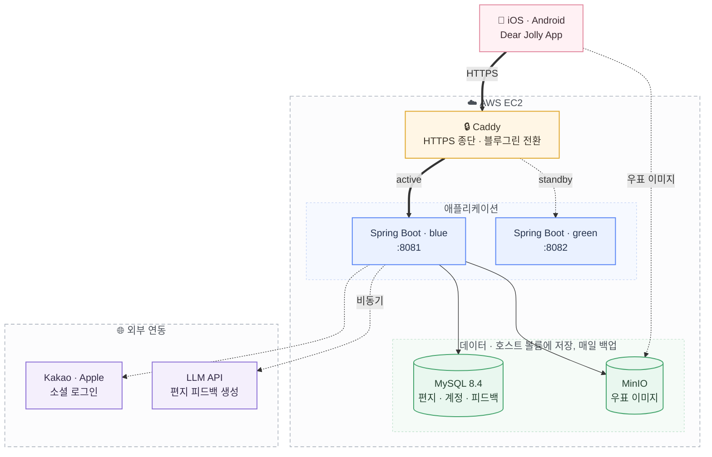

# Dear Jolly 🎀

> *Write to Jolly ✏️, feel jolly 🎀*

## 소개 ✨

**Dear Jolly** 는 하루를 영어로 기록해 Jolly에게 편지를 보내는 앱입니다.
오늘 있었던 일을 영어 편지로 적어 Jolly 에게 전달하면, AI 가 표현을 다듬어 **교정과 팁이 담긴 답장**을 보내줍니다.

답장이 도착한 편지에는 **우표**가 한 장씩 붙습니다.
잘 쓴 날에만 주어지는 게 아니라 꾸준히 쓴 만큼 쌓이기 때문에, 우표첩은 그대로 하루하루를 이어온 기록이 됩니다.
완벽한 문장을 쓰려 애쓰기보다 오늘의 이야기를 계속 남겨보는 것은 어떨까요?

## Architecture ✨

| 구성 | 역할 |
| --- | --- |
| 🔒 **Caddy** | TLS 를 종단하고, 배포할 때 blue ↔ green 사이에서 트래픽을 무중단 전환한다 |
| ⚙️ **Spring Boot** | 소셜 로그인부터 JWT 발급까지 인증 책임 전부를 서버가 진다 |
| 🗄️ **MySQL · MinIO** | 컨테이너가 아니라 호스트 디렉터리에 저장돼 컨테이너를 지워도 남는다. 매일 자동 백업 |
| 🤖 **LLM API** | 편지 피드백은 **비동기**다. 작성 응답은 즉시 돌아가고, 답장이 완료된 뒤 우표가 부여된다 |

## Tech Stack ✨

| 구분 | 사용 기술 |
| --- | --- |
| Language | Java 21 (Eclipse Temurin) |
| Framework | Spring Boot 3.5.7 (Web, Validation, Actuator) |
| ORM | Spring Data JPA · Hibernate |
| Database | MySQL 8.4 (`utf8mb4` / `Asia/Seoul`) |
| Migration | Flyway |
| Authentication | Spring Security · JWT (jjwt) · Kakao · Apple OAuth |
| Storage | MinIO (S3 호환, 우표 이미지) |
| Model | OpenAI API |
| Testing | JUnit 5 · Mockito · RestAssured · Testcontainers · H2 |
| Build | Gradle 8.14.3 (Wrapper) |
| Infra | AWS EC2 · ECR · CloudFormation, Docker · Docker Compose, Caddy |
| CI/CD | GitHub Actions (블루그린 무중단 배포) |
| API Docs | Swagger (springdoc-openapi) |
| IDE | IntelliJ |

## 문서 ✨

| 문서 | 내용 |
| --- | --- |
| [docs/RUN.md](docs/RUN.md) | **로컬 실행 방법 · 환경변수 · 테스트** |
| [docs/기능명세.md](docs/기능명세.md) | 도메인 규칙 · 처리 흐름 |
| [docs/API명세.md](docs/API명세.md) | 요청/응답 계약의 정본 |
| [docs/ERD.md](docs/ERD.md) | 데이터 모델의 정본 |
| [infra/README.md](infra/README.md) | 구축 · 배포 · 운영 |
