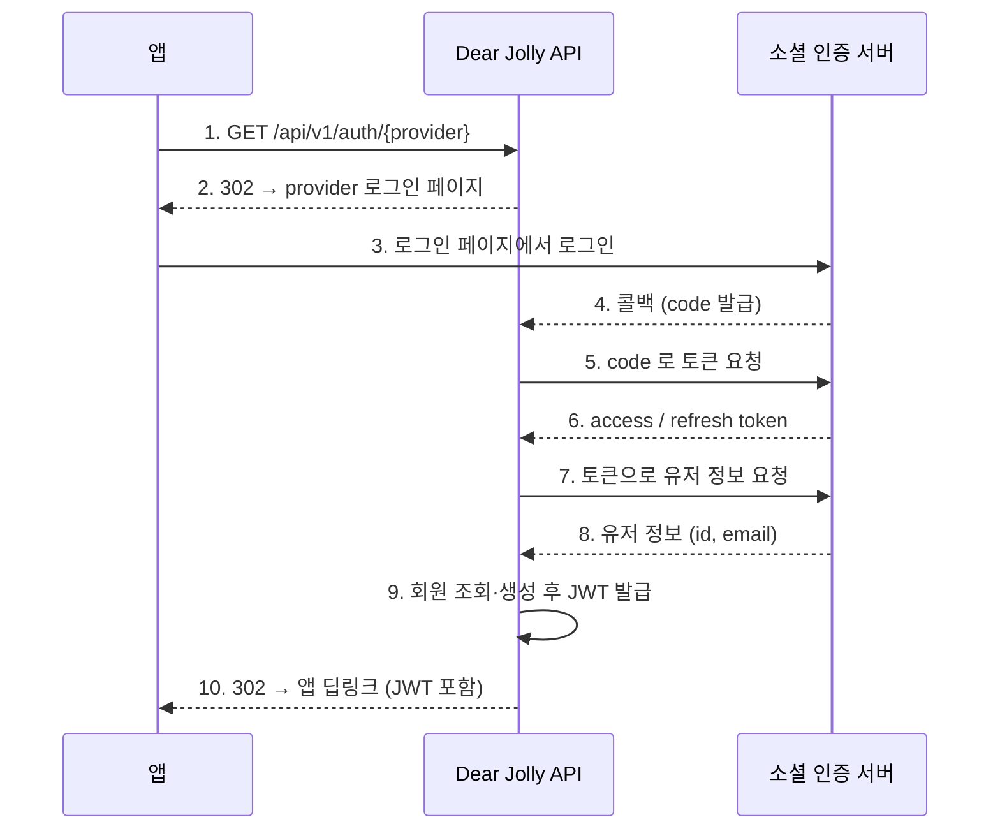

# Dear Jolly — API 명세서 (MVP)

> 이 문서는 **요청/응답 계약의 정본**이다. 각 API 의 `설명` 항목은 앱·서버가 함께 지켜야 하는 조건을 담고 있고, 전체 규칙과 처리 흐름은 [기능명세.md](./기능명세.md), 테이블·제약 조건은 [ERD.md](./ERD.md) 를 따른다.

| 항목 | 내용 |
| --- | --- |
| 최종 갱신 | 2026-08-22 |
| Base URL | `https://{host}` |
| 인증 | `Authorization: Bearer {accessToken}` |
| Content-Type | `application/json; charset=UTF-8` |
| 날짜 포맷 | `LocalDate` → `yyyy-MM-dd` / `LocalDateTime` → `yyyy-MM-dd'T'HH:mm:ss` |

---

## 1. 엔드포인트 목록

| # | 패키지 | Method | 엔드포인트 | 설명 | 인증 | 온보딩 | 구현 |
| :---: | --- | --- | --- | --- | :---: | :---: | :---: |
| [1](#1-get-apiv1authprovider) | user | `GET` | `/api/v1/auth/{provider}` | 소셜 로그인 시작 (provider 로그인 페이지로 리다이렉트) | — | — | ✅ |
| [2](#2-get-apiv1authkakaocallback) | user | `GET` | `/api/v1/auth/kakao/callback` | 카카오 콜백 (앱 딥링크로 리다이렉트) | — | — | ✅ |
| [3](#3-post-apiv1authapplecallback) | user | `POST` | `/api/v1/auth/apple/callback` | 애플 콜백 (`form_post`, 앱 딥링크로 리다이렉트) | — | — | ✅ |
| [4](#4-post-apiv1authreissue) | user | `POST` | `/api/v1/auth/reissue` | 토큰 재발급 | — | — | ✅ |
| [5](#5-post-apiv1authlogout) | user | `POST` | `/api/v1/auth/logout` | 로그아웃 | ✔ | — | ✅ |
| [6](#6-post-apiv1usersterms) | user | `POST` | `/api/v1/users/terms` | 약관 동의 · 마케팅 동의 철회 | ✔ | — | ✅ |
| [7](#7-get-apiv1users) | user | `GET` | `/api/v1/users` | 계정 정보 조회 | ✔ | — | ✅ |
| [8](#8-delete-apiv1users) | user | `DELETE` | `/api/v1/users` | 회원 탈퇴 | ✔ | — | ✅ |
| [9](#9-patch-apiv1usersnickname) | user | `PATCH` | `/api/v1/users/nickname` | 닉네임 설정 | ✔ | — | ✅ |
| [10](#10-post-apiv1letters) | letter | `POST` | `/api/v1/letters` | 편지 작성 + 피드백 요청 | ✔ | ✔ | ❌ |
| [11](#11-get-apiv1lettersletterid) | letter | `GET` | `/api/v1/letters/{letterId}` | 편지 및 피드백 상세 조회 | ✔ | ✔ | ❌ |
| [12](#12-get-apiv1letters) | letter | `GET` | `/api/v1/letters` | 전체 편지 리스트 조회 | ✔ | ✔ | ❌ |
| [13](#13-get-apiv1home) | letter | `GET` | `/api/v1/home` | 닉네임, 모은 우표 수 조회 | ✔ | ✔ | ❌ |
| [14](#14-get-apiv1version) | global | `GET` | `/api/v1/version` | 최소 지원 버전 조회 | — | — | ✅ |

- **패키지** 열은 서버 구현 위치다. `version` 은 도메인이 아니라 `global` 하위이며, `/api/v1/home` 은 편지 집계가 본질이므로 `letter` 도메인에 둔다.
- **온보딩** 열이 ✔ 인 API 는 온보딩 미완료 시 `USER_005` 로 차단된다.
- **구현** 열은 현재 서버에 코드가 있는지를 뜻한다. ✅ 는 통합 테스트까지 있는 상태, ❌ 는 명세만 확정되고 아직 구현 전이다. `letter` 도메인 4종은 엔티티만 있고 컨트롤러·서비스가 없다.
- **`{provider}` 는 대문자**(`KAKAO` · `APPLE`)다. 콜백 경로만 provider 콘솔에 등록된 소문자 고정 문자열(`/auth/kakao/callback`)이며, 소문자로 `/api/v1/auth/kakao` 를 호출하면 `COMMON_001` 이다.

---

## 2. API 명세

### 1) GET /api/v1/auth/{provider}

> 구현 완료 ✅

#### [설명]

카카오 / 애플 소셜 로그인을 시작한다. 앱은 이 주소로 이동하기만 하면 되고, 응답으로 받은 provider 로그인 페이지를 외부 브라우저 또는 웹뷰로 연다.

**인증 책임을 전부 백엔드가 진다.** 로그인 페이지 요청 → 코드 발급 → 토큰 교환 → 유저 정보 조회 → JWT 발급까지 서버가 처리한다. 앱 SDK 로 받은 소셜 토큰을 서버에 전달하는 방식은 지원하지 않는다.

- 유저는 `(provider, provider 회원 식별자)` 조합으로 식별한다. 같은 이메일이라도 카카오와 애플은 별개 계정이다.
- `state` 파라미터를 authorize URL 에 실어 보내지만 **MVP 는 콜백에서 이 값을 검증하지 않는다.**

전체 흐름은 다음과 같다.



#### [스펙]

**Endpoint**

```
GET /api/v1/auth/{provider}
```

**Path Variable**

- [필수] `provider` (String): 로그인 수단 (`KAKAO`, `APPLE`). 대문자만 허용한다

**Authorization 헤더**: 불필요

#### [성공 Response 302]

provider 의 로그인 페이지로 리다이렉트한다.

```
HTTP/1.1 302 Found
Location: https://kauth.kakao.com/oauth/authorize?client_id=...&redirect_uri=...&response_type=code&state=...
```

#### [실패 Error Response]

| code | status | 상황 |
| --- | --- | --- |
| `COMMON_001` | 400 | 지원하지 않는 `provider`, 또는 소문자 등 정의되지 않은 표기 |

> `{provider}` 는 `OauthProvider` enum 으로 받는다. 정의되지 않은 값은 컨트롤러에 닿기 전 타입 변환 단계에서 걸러지므로 `COMMON_001` 로 통일한다.

---

### 2) GET /api/v1/auth/kakao/callback

> 구현 완료 ✅

#### [설명]

카카오가 호출하는 주소다. **앱이 직접 호출하지 않는다.** 카카오는 쿼리 파라미터로 인가 코드를 돌려주므로 `GET` 으로 받는다.

서버는 인가 코드를 토큰으로 교환하고 회원 정보를 조회한 뒤, 회원을 찾거나 새로 만들고 JWT 를 발급해 앱 딥링크로 리다이렉트한다.

- 가입 직후에는 약관 동의 이력이 없고 닉네임이 `null` 이다. 앱은 딥링크로 받은 온보딩 상태로 진입 화면을 결정한다.
- Refresh Token 은 **유저당 1개만 유지**한다(단일 세션). 새로 로그인하면 이전 토큰은 무효가 된다.
- **탈퇴한 계정으로 다시 로그인하면 항상 신규 가입**이다(`isNewUser=true`). 이전 편지는 복원되지 않는다.
- 서버는 provider 가 준 refresh token 을 함께 저장한다. 탈퇴 시 연결 해제에 필요하기 때문이다.

#### [스펙]

**Endpoint**

```
GET /api/v1/auth/kakao/callback
```

**Authorization 헤더**: 불필요

**Request Parameter**

- [필수] `code` (String): 카카오가 발급한 인가 코드
- [선택] `state` (String): 로그인 시작 때 서버가 붙여 보낸 값이 그대로 돌아온다. MVP 는 검증하지 않는다

#### [성공 Response 302]

발급한 JWT 와 온보딩 상태를 쿼리 파라미터에 실어 앱 딥링크로 리다이렉트한다.

```
HTTP/1.1 302 Found
Location: dearjolly://auth/callback
            ?accessToken=eyJhbGciOiJIUzI1NiJ9...
            &refreshToken=eyJhbGciOiJIUzI1NiJ9...
            &userId=1
            &isNewUser=true
            &termsAgreed=false
            &nicknameRegistered=false
```

- [필수] `accessToken` (String): 액세스 토큰 (30분)
- [필수] `refreshToken` (String): 리프레시 토큰 (14일)
- [필수] `userId` (Long): 유저 ID
- [필수] `isNewUser` (Boolean): 이번 요청으로 가입된 유저인지 여부
- [필수] `termsAgreed` (Boolean): 필수 약관(`SERVICE` · `PRIVACY`) 동의 완료 여부
- [필수] `nicknameRegistered` (Boolean): 닉네임 등록 여부

딥링크 주소는 `OAUTH_APP_REDIRECT_URI` 환경변수로 바꿀 수 있다.

**앱 분기**

| 조건 | 이동 화면 |
| --- | --- |
| `termsAgreed == false` | 온보딩 – 약관동의 |
| `termsAgreed == true && nicknameRegistered == false` | 온보딩 – 닉네임 |
| 둘 다 `true` | 홈 |

> **주의**: 토큰이 URL 쿼리 파라미터에 실린다. 앱은 딥링크를 받은 즉시 토큰을 보안 저장소
> (iOS Keychain / Android EncryptedSharedPreferences)로 옮기고, 웹뷰를 쓴다면 히스토리를 비운다.

#### [실패 Error Response]

콜백 단계의 실패는 딥링크가 아니라 **JSON 에러 응답**으로 나간다.

| code | status | 상황 |
| --- | --- | --- |
| `AUTH_002` | 401 | 인가 코드 검증 실패 |
| `AUTH_003` | 502 | 카카오 서버 통신 실패 |

---

### 3) POST /api/v1/auth/apple/callback

> 구현 완료 ✅

#### [설명]

애플이 호출하는 주소다. **앱이 직접 호출하지 않는다.** `scope` 를 요청하면 Apple 이 `response_mode=form_post` 를 강제하므로 `POST` 로 받으며, `code` 와 `id_token` 이 form 으로 온다.

회원 식별자(`sub`)와 이메일은 `id_token` 에서 꺼낸다. 서버는 Apple 공개키(JWK)로 서명을 검증하고 `iss` · `aud` · `exp` 를 확인한다.

- Apple 은 private relay 를 거부하면 이메일을 주지 않는다. 이때 `email` 은 `null` 로 저장하며 **서버가 대체 주소를 지어내지 않는다.**
- 나머지 회원 식별·토큰 정책은 카카오 콜백과 같다.

#### [스펙]

**Endpoint**

```
POST /api/v1/auth/apple/callback
```

**Authorization 헤더**: 불필요

**Request Parameter** (`application/x-www-form-urlencoded`)

- [필수] `code` (String): 애플이 발급한 인가 코드
- [필수] `id_token` (String): 회원 식별자(`sub`)와 이메일을 여기서 꺼낸다
- [선택] `state` (String): 로그인 시작 때 서버가 붙여 보낸 값이 그대로 돌아온다. MVP 는 검증하지 않는다

#### [성공 Response 302]

카카오 콜백과 동일한 형태로 앱 딥링크에 리다이렉트한다. 파라미터 구성과 앱 분기 규칙은 [2) GET /api/v1/auth/kakao/callback](#2-get-apiv1authkakaocallback) 을 따른다.

#### [실패 Error Response]

| code | status | 상황 |
| --- | --- | --- |
| `AUTH_002` | 401 | 인가 코드 · `id_token` 검증 실패 |
| `AUTH_003` | 502 | 애플 서버 통신 실패 |

---

### 4) POST /api/v1/auth/reissue

> 구현 완료 ✅

#### [설명]

Refresh Token 으로 Access Token 을 재발급한다. Refresh Token 도 함께 재발급(회전)되며 이전 토큰은 즉시 무효화된다.

- Access Token 만료는 30분, Refresh Token 만료는 14일이다.
- 전달받은 Refresh Token 이 **서버에 저장된 값과 문자열까지 일치**해야 한다. 불일치하면 탈취된 이전 토큰의 재사용으로 보고 거절한다.
- **만료된 Access Token 으로도 호출할 수 있도록 인증 필터에서 제외한다.** `Authorization` 헤더가 실려 와도 서버는 읽지 않는다. 앱의 토큰 인터셉터가 모든 요청에 헤더를 붙여도 재발급은 정상 동작한다.
- 탈퇴 처리된 계정의 Refresh Token 은 탈퇴 시점에 `null` 이 되므로 `AUTH_004` 로 거절된다.

#### [스펙]

**Endpoint**

```
POST /api/v1/auth/reissue
```

**Authorization 헤더**: 불필요. 만료된 토큰이 실려 있어도 서버가 무시하므로 앱이 헤더를 떼어낼 필요가 없다.

**Body**

```json
{
    "refreshToken": "eyJhbGciOiJIUzI1NiJ9..."
}
```

- [필수] `refreshToken` (String): 로그인 시 발급받은 리프레시 토큰

#### [성공 Response 200]

```json
{
    "accessToken": "eyJhbGciOiJIUzI1NiJ9...",
    "refreshToken": "eyJhbGciOiJIUzI1NiJ9..."
}
```

- [필수] `accessToken` (String): 새 액세스 토큰
- [필수] `refreshToken` (String): 새 리프레시 토큰 (앱은 기존 값을 이 값으로 교체 저장)

#### [실패 Error Response]

```json
{
    "status": 401,
    "code": "AUTH_004",
    "message": "로그인이 만료되었습니다. 다시 로그인해주세요."
}
```

| code | status | 상황 |
| --- | --- | --- |
| `AUTH_004` | 401 | Refresh Token 만료 · 위조 · 서버 저장값과 불일치 |

앱은 `AUTH_004` 를 받으면 저장된 토큰을 폐기하고 로그인 화면으로 이동한다.

---

### 5) POST /api/v1/auth/logout

> 구현 완료 ✅

#### [설명]

서버에 저장된 Refresh Token 을 무효화한다. 카카오 세션 종료 등 소셜 로그아웃은 앱 SDK 에서 처리한다.

- 로그아웃은 **세션만 끊는다.** 편지·계정 데이터는 그대로 보존된다 (디자인 문구: *"편지는 잘 보관해 둘게요. 언제든 다시 와요!"*).
- 계정과 데이터를 지우는 것은 회원 탈퇴뿐이다.
- 온보딩 미완료 상태에서도 호출할 수 있다.

#### [스펙]

**Endpoint**

```
POST /api/v1/auth/logout
```

**Authorization 헤더**

```
Bearer eyJhbGciOiJIUzI1NiJ9...
```

**Body**: 없음

#### [성공 Response 204]

```
(No Content)
```

#### [실패 Error Response]

공통 인증 실패 코드(`AUTH_005` · `AUTH_007`)만 발생한다.

---

### 6) POST /api/v1/users/terms

> 구현 완료 ✅

#### [설명]

온보딩 약관 동의 내역을 저장한다. 설정 화면에서 마케팅 동의를 철회할 때도 같은 API 를 쓴다. 필수 약관(`SERVICE`, `PRIVACY`)에 모두 동의해야 통과한다.

- `MARKETING` 은 선택 항목이며 동의하지 않아도 서비스 이용에 제한이 없다.
- 동의 내역은 **덮어쓰지 않고 이력으로 누적**한다. 요청에 담긴 항목마다 새 행이 쌓이며, 현재 상태는 항목별 최신 행이다.
- 동의 시각은 **서버 시각(KST)** 으로 기록한다. 동의 시점의 약관 버전도 함께 기록한다.
- **약관이 개정돼도 재동의를 요구하지 않는다.** 버전은 사후 입증용 기록이며 `termsAgreed` 판별에 쓰지 않는다.
- 요청 바디에 포함하지 않은 항목은 건드리지 않는다. 마케팅만 철회하려면 `MARKETING` 한 건만 보내면 된다.
- **`USER_002` 로 실패하면 그 요청의 INSERT 는 전부 롤백된다.** 필수 약관이 채워지지 않은 채 동의 이력만 절반 쌓이는 상태를 만들지 않기 위해서다. 앱은 필수 2건을 항상 함께 보낸다.
- 약관 본문은 서버가 제공하지 않는다. 웹뷰 링크로 처리한다.

#### [스펙]

**Endpoint**

```
POST /api/v1/users/terms
```

**Authorization 헤더**

```
Bearer eyJhbGciOiJIUzI1NiJ9...
```

**Body**

```json
{
    "agreements": [
        { "type": "SERVICE",   "agreed": true },
        { "type": "PRIVACY",   "agreed": true },
        { "type": "MARKETING", "agreed": false }
    ]
}
```

- [필수] `agreements` (Array): 약관 동의 목록 (1개 이상)
    - [필수] `type` (String): 약관 종류 (`SERVICE`, `PRIVACY`, `MARKETING`)
    - [필수] `agreed` (Boolean): 동의 여부

**마케팅 철회 예시**

```json
{
    "agreements": [
        { "type": "MARKETING", "agreed": false }
    ]
}
```

#### [성공 Response 200]

```json
{
    "termsAgreed": true
}
```

- [필수] `termsAgreed` (Boolean): 이 요청 반영 후의 필수 약관 동의 완료 여부

#### [실패 Error Response]

```json
{
    "status": 400,
    "code": "USER_002",
    "message": "필수 약관에 모두 동의해야 합니다."
}
```

| code | status | 상황 |
| --- | --- | --- |
| `USER_002` | 400 | 이 요청 반영 후에도 `SERVICE` 또는 `PRIVACY` 가 미동의 상태 |
| `USER_001` | 404 | 사용자를 찾을 수 없음 |

> 인증 필터가 요청마다 유저 행을 확인하므로, 행이 없는 토큰은 컨트롤러에 닿기 전 `AUTH_005`(401) 로 끝난다. `USER_001` 은 필터 통과와 서비스 실행 사이에 유예기간 만료 배치가 그 행을 지운 경우를 위한 방어선이다.

---

### 7) GET /api/v1/users

> 구현 완료 ✅

#### [설명]

설정 화면에 표시할 계정 정보를 조회한다.

- 이메일은 Apple private relay 거부 등으로 제공되지 않을 수 있다. 이 경우 `null` 이며 앱은 provider 명만 표시한다. **서버가 대체 주소를 지어내지 않는다.**
- 온보딩을 마치지 않은 유저는 `nickname` 이 `null` 이다. 이 API 는 온보딩 가드 대상이 아니므로 그 상태로도 호출된다.
- `marketingAgreed` 는 `MARKETING` 의 **최신 동의 이력**의 값이다. 이력이 없으면 `false` 다.

#### [스펙]

**Endpoint**

```
GET /api/v1/users
```

**Authorization 헤더**

```
Bearer eyJhbGciOiJIUzI1NiJ9...
```

#### [성공 Response 200]

```json
{
    "nickname": "ilovesally",
    "provider": "KAKAO",
    "email": "kakao_user@email.com",
    "marketingAgreed": true
}
```

- [선택] `nickname` (String): 유저 닉네임 (**온보딩 전에는 `null`**)
- [필수] `provider` (String): 로그인 수단 (`KAKAO`, `APPLE`) — 앱에서 아이콘 매핑
- [선택] `email` (String): 소셜 계정 이메일 (provider 미제공 시 `null`)
- [필수] `marketingAgreed` (Boolean): 마케팅 수신 동의 여부

#### [실패 Error Response]

```json
{
    "status": 404,
    "code": "USER_001",
    "message": "사용자를 찾을 수 없습니다."
}
```

| code | status | 상황 |
| --- | --- | --- |
| `USER_001` | 404 | 사용자를 찾을 수 없음 |

유저 행이 없으면 필터 단계에서 `AUTH_005` 로 끝나므로 실제로는 거의 나가지 않는다.

---

### 8) DELETE /api/v1/users

> 구현 완료 ✅

#### [설명]

회원 탈퇴를 처리한다. 모든 편지와 계정 정보가 삭제되며 복구할 수 없다.

- **사용자 관점에서 삭제는 되돌릴 수 없다.** 편지·피드백·교정 내역이 모두 사라진다 (디자인 문구: *"탈퇴하면 모든 편지와 계정 정보가 함께 삭제되며 다시 복구할 수 없어요."*).
- **서버는 즉시 접근을 차단한 뒤 30일간 데이터를 보존하고, 유예기간이 지나면 완전 삭제한다.** 오삭제 복구와 분쟁 대응을 위한 내부 보존이며, 사용자에게 노출되는 복구 수단은 없다. 이 사실은 개인정보처리방침의 보유기간 항목에 명시한다.
- 탈퇴 즉시 Refresh Token 이 무효화되고, 남아 있는 Access Token 도 `AUTH_007`(401) 로 거절된다.
- 탈퇴 후 같은 소셜 계정으로 다시 로그인하면 **신규 가입**으로 처리된다.
- Apple 유저는 **토큰 revoke 가 필수**다(App Store 심사 요건). 서버가 로그인 때 저장해 둔 refresh token 으로 수행하므로 앱이 인가 코드를 따로 보낼 필요가 없다.
- 소셜 연결 해제(unlink / revoke)에 실패해도 **탈퇴 처리는 계속 진행**한다. 사용자가 탈퇴하지 못하는 상태에 갇히지 않게 하기 위함이다.
- 온보딩 미완료 상태에서도 탈퇴할 수 있다.

**처리 순서**

1. 소셜 연결 해제 (Kakao `unlink` / Apple `revoke`, 저장해 둔 provider refresh token 사용) — **트랜잭션 밖에서** 수행하며, 실패해도 로그만 남기고 탈퇴는 계속 진행
2. 계정을 탈퇴 상태로 전환하고 Refresh Token 을 무효화 (단일 트랜잭션)
3. 유예기간(30일) 경과 후 배치가 유저 행을 삭제하면 약관 이력·편지·피드백·교정 조각·팁이 cascade 로 함께 제거된다

> 삭제 순서를 서버 코드가 지정하지 않는다. 유저 엔티티 하나를 삭제하면 JPA cascade 가 전 구간을 연쇄 삭제한다.

#### [스펙]

**Endpoint**

```
DELETE /api/v1/users
```

**Authorization 헤더**

```
Bearer eyJhbGciOiJIUzI1NiJ9...
```

**Body**: 없음

#### [성공 Response 204]

```
(No Content)
```

#### [실패 Error Response]

```json
{
    "status": 404,
    "code": "USER_001",
    "message": "사용자를 찾을 수 없습니다."
}
```

| code | status | 상황 |
| --- | --- | --- |
| `USER_001` | 404 | 사용자를 찾을 수 없음 |

---

### 9) PATCH /api/v1/users/nickname

> 구현 완료 ✅

#### [설명]

닉네임을 등록하거나 변경한다. 온보딩(이름 입력)과 설정(이름 변경)이 동일한 API 를 쓴다.

- 닉네임은 Jolly 에게 보여줄 **표시용 이름**이므로 **중복을 허용**한다. 유니크 제약이 없어 중복 에러도 없다.
- 영문·숫자 1~20자만 허용한다. 길이는 **문자 수** 기준으로 세며 앱의 `10/20` 카운터와 일치한다.
- **검증은 길이 → 문자 순서로 수행한다.** 두 조건을 동시에 어겨도 먼저 걸린 사유 하나만 반환한다. 앱이 사유별로 다른 문구를 보여줘야 하기 때문이다.
- 검증은 **전 구간을 서비스가 맡는다.** 요청 DTO 에 Bean Validation 어노테이션을 두지 않는다 — 어노테이션이 먼저 걸리면 `null` · 빈 값 · 공백이 모두 `COMMON_001` 이 되어 사유를 구분할 수 없다.
- 변경 횟수에 제한이 없고, 이전 닉네임은 보관하지 않는다.
- 앱은 사유별 문구(`공백을 포함할 수 없어요` / `특수 기호를 포함할 수 없어요` / `한글을 포함할 수 없어요`)를 클라이언트에서 판별해 표시한다. 서버는 최종 방어선이다.

#### [스펙]

**Endpoint**

```
PATCH /api/v1/users/nickname
```

**Authorization 헤더**

```
Bearer eyJhbGciOiJIUzI1NiJ9...
```

**Body**

```json
{
    "nickname": "iloveJolly"
}
```

- [필수] `nickname` (String): 변경할 닉네임 (영문 + 숫자, 1~20자)

**검증 규칙**

| 순서 | 규칙 | 값 | code |
| --- | --- | --- | --- |
| 1 | 길이 | 1 ~ 20자 (문자 수). `null` · `""` 는 0자로 본다 | `USER_004` |
| 2 | 허용 문자 | `^[A-Za-z0-9]+$` | `USER_003` |
| — | 공백 · 특수기호 · 한글 | 불가 | `USER_003` |
| — | 중복 | **허용** (표시용 이름) | — |

- 정규식에 길이 수량자(`{1,20}`)를 넣지 않는다. 넣으면 길이 위반과 문자 위반이 같은 코드로 뭉개진다.
- 21자 영문은 `USER_004`, 5자 한글은 `USER_003`, 21자 한글은 `USER_004` 다.
- `null` 과 `""` 는 0자이므로 `USER_004`, **공백만 있는 `"   "` 는 길이(3자)를 통과해 문자 검증에서 `USER_003`** 이다.

#### [성공 Response 200]

```json
{
    "nickname": "iloveJolly"
}
```

- [필수] `nickname` (String): 변경된 닉네임

#### [실패 Error Response]

```json
{
    "status": 400,
    "code": "USER_003",
    "message": "닉네임은 공백, 특수기호, 한글 없이 작성해야 합니다."
}
```

| code | status | 상황 |
| --- | --- | --- |
| `USER_003` | 400 | 공백 · 특수기호 · 한글 포함 |
| `USER_004` | 400 | 1자 미만 또는 20자 초과 |
| `USER_001` | 404 | 사용자를 찾을 수 없음 |

---

### 10) POST /api/v1/letters

> 미구현 ❌

#### [설명]

새로운 편지를 작성한다. 편지가 저장되면 AI 피드백 프로세스가 트리거되며, 피드백은 비동기로 처리되므로 이 API 는 결과를 기다리지 않고 즉시 반환한다.

- 편지는 **전달 후 수정·삭제할 수 없다.** 수정·삭제 API 자체를 제공하지 않는다 (디자인 문구: *"전달된 편지는 다시 고칠 수 없어요."*).
- 본문은 **영어 전용, 1~500자**다. 한글이 섞이면 거부한다. 숫자·구두점·이모지는 허용한다.
- 편지 날짜는 **클라이언트가 보낸 작성 시각**의 날짜 부분이다. 작성 화면의 `DATE:` 는 변경할 수 없는 UI 이므로 화면 표시와 항상 일치하며, 서버는 임의 날짜 조작만 차단한다.
- **하루 작성 개수 제한이 없다.** 같은 날짜에 여러 통을 쓰면 목록에 같은 날짜 카드가 여러 개 쌓인다.
- 생성 직후 상태는 항상 `SUBMITTED` 이고, 우표는 **아직 부여되지 않는다.** 피드백이 완료돼야 우표가 도착한다.
- **중복 전달은 서버가 막는다.** 동일 유저가 60초 이내에 같은 본문을 다시 보내면 새 편지를 만들지 않고 최초 편지를 `200 OK` 로 반환한다. 앱이 별도 헤더를 보낼 필요가 없다.

#### [스펙]

**Endpoint**

```
POST /api/v1/letters
```

**Authorization 헤더**

```
Bearer eyJhbGciOiJIUzI1NiJ9...
```

**Body**

```json
{
    "content": "I got flowers from a friend today...",
    "writtenAt": "2025-11-01T21:00:00",
    "timeZone": "Asia/Seoul"
}
```

- [필수] `content` (String): 편지 내용 (최대 500자)
- [필수] `writtenAt` (LocalDateTime): **기기 로컬 기준** 작성 시각 (`yyyy-MM-dd'T'HH:mm:ss`)
- [필수] `timeZone` (String): IANA 타임존 ID (예: `Asia/Seoul`). 편지와 함께 저장되어 이후 조회의 시각 변환 기준이 된다

**검증 규칙**

| 규칙 | 상세 | code |
| --- | --- | --- |
| 필수 | `content` 가 `null` / 공백만 있는 값 불가 | `LETTER_001` |
| 길이 | **500자 초과** 불가 (문자 수, 공백 포함) | `LETTER_003` |
| 언어 | `[가-힣ㄱ-ㅎㅏ-ㅣ]` 포함 시 거부 | `LETTER_004` |
| 타임존 | `ZoneId` 로 해석 가능한 IANA ID | `LETTER_005` |
| 작성 시각 | `writtenAt` 을 `timeZone` 으로 해석한 절대 시각이 서버 현재 시각 기준 ±24시간 이내 | `LETTER_005` |

- 0자·공백은 `LETTER_001` 이 담당하므로 `LETTER_003` 은 **상한만** 판정한다. 두 코드의 담당 구간이 겹치지 않는다.
- 편지 날짜(`date`)는 `writtenAt` 의 날짜 부분이다. `writtenAt` 이 이미 기기 로컬 시각이므로 별도 환산이 없다. `timeZone` 은 ±24시간 검증과 `createdAt` 변환에 쓴다.

#### [성공 Response 201]

```json
{
    "letterId": 16,
    "date": "2025-11-01",
    "createdAt": "2025-11-01T21:00:03"
}
```

- [필수] `letterId` (Long): 편지 ID
- [필수] `date` (LocalDate): 편지 날짜 (`writtenAt` 의 날짜 부분)
- [필수] `createdAt` (LocalDateTime): 저장 시각 (요청의 `timeZone` 기준으로 변환)

#### [성공 Response 200 — 중복 전달]

동일 유저가 60초 이내에 같은 `content` 를 다시 보낸 경우다. 응답 본문은 **최초 편지의 생성 결과와 동일**하다.

```json
{
    "letterId": 16,
    "date": "2025-11-01",
    "createdAt": "2025-11-01T21:00:03"
}
```

- 앱은 201 과 200 을 구분할 필요 없이 동일하게 완료 화면으로 이동한다.
- 새 편지가 만들어지지 않으므로 피드백도 중복 요청되지 않는다.

#### [실패 Error Response]

```json
{
    "status": 400,
    "code": "LETTER_001",
    "message": "편지 내용은 null일 수 없습니다."
}
```

| code | status | 상황 |
| --- | --- | --- |
| `LETTER_001` | 400 | `content` 가 `null` / 빈 값 / 공백만 있는 값 |
| `LETTER_003` | 400 | 500자 초과 |
| `LETTER_004` | 400 | 한글 포함 |
| `LETTER_005` | 400 | `writtenAt` / `timeZone` 이 올바르지 않음 |
| `USER_005` | 400 | 온보딩 미완료 |

---

### 11) GET /api/v1/letters/{letterId}

> 미구현 ❌

#### [설명]

특정 편지의 상세 내용과 도착한 피드백(교정문, 팁 등)을 조회한다. 조회에 성공하면 해당 편지는 읽음 처리된다.

- **본인 편지만** 조회할 수 있다. 타인의 편지는 존재 여부를 숨기기 위해 403 이 아닌 404 로 응답한다.
- 피드백 완료 전에도 응답은 성공하지만 `feedback` 이 `null` 이다. 앱은 완료 전 카드의 진입 자체를 막는다.
- 읽음 처리는 이 API 의 **부수 효과**다. 별도의 읽음 처리 API 는 없으며, 한 번 읽으면 다시 미열람으로 되돌아가지 않는다.
- 교정 결과는 원문 전체를 순서대로 자른 조각(`correctionSegments`)으로 내려간다. 조각을 이어붙이면 원문·교정문이 그대로 복원되는 것을 서버가 보장한다.
- 팁은 편지마다 0~3개다. 없을 수도 있다 (잘 쓴 편지).
- 우표는 **AI 가 편지 내용에 어울리는 것으로 고른다.** 우표 종류는 DB(`stamps` 테이블)가 관리하므로 운영 중 추가·교체될 수 있다. 앱은 `stampImage` URL 을 그대로 표시하고 **우표 종류를 코드로 분기하지 않는다.** 서버가 우표에 대해 가진 정보도 이름과 이미지뿐이라 응답에 실을 설명 문구가 없다.

**렌더링 계약**

- `correctionSegments` 를 `sequence` 순서대로 이어붙이면 **`originalText` 는 `originalContent` 전체**, **`correctedText` 는 `correctedContent` 전체**와 정확히 일치한다. 앱은 인덱스 계산 없이 순차 렌더링만 하면 된다.
- `type == "UNCHANGED"` → 검은 글씨 그대로 출력
- `type == "MODIFIED"` → `originalText` 를 빨간 취소선, 바로 뒤에 `correctedText` 를 초록 하이라이트로 출력
- 공백은 세그먼트 문자열에 포함해 내려준다 (앱에서 공백을 임의로 추가하지 않음).
- 삭제 제안은 `type == "MODIFIED"` + `correctedText == ""` 로 표현한다.
- `tips` 가 `[]` 면 팁 영역을 표시하지 않는다.

#### [스펙]

**Endpoint**

```
GET /api/v1/letters/{letterId}
```

**Authorization 헤더**

```
Bearer eyJhbGciOiJIUzI1NiJ9...
```

**Path Variable**

- [필수] `letterId` (Long): 조회할 편지의 ID

#### [성공 Response 200]

```json
{
    "letterId": 15,
    "date": "2025-11-01",
    "originalContent": "I got flowers from a friend today...",
    "status": "FEEDBACK_COMPLETED",
    "stampImage": "http://localhost:9000/dear-jolly-stamps/stamps/flower_stamp.png",
    "feedback": {
        "feedbackId": 101,
        "correctedContent": "I received flowers from a friend today...",
        "tips": [
            "이 문맥에서는 'got'보다 'received'가 더 자연스러워요.",
            "'that'은 선행사를 한정하는 필수 정보를, 'which'는 추가 정보를 제공하는 데 쓰여요!"
        ],
        "correctionSegments": [
            {
                "sequence": 1,
                "originalText": "I ",
                "correctedText": "I ",
                "type": "UNCHANGED"
            },
            {
                "sequence": 2,
                "originalText": "got",
                "correctedText": "received",
                "type": "MODIFIED"
            },
            {
                "sequence": 3,
                "originalText": " flowers from a friend today",
                "correctedText": " flowers from a friend today",
                "type": "UNCHANGED"
            }
        ]
    }
}
```

- [필수] `letterId` (Long): 편지 ID
- [필수] `date` (LocalDate): 편지 날짜 (`yyyy-MM-dd`)
- [필수] `originalContent` (String): 원본 편지 내용
- [필수] `status` (String): 편지 상태 (`SUBMITTED`, `FEEDBACK_IN_PROGRESS`, `FEEDBACK_COMPLETED`). 내부 상태 `FEEDBACK_FAILED` 는 `SUBMITTED` 로 치환돼 내려간다
- [선택] `stampImage` (String): 우표 이미지 URL. 서버가 `MINIO_PUBLIC_ENDPOINT` + 버킷 + `image_key` 로 조립해 내려준다 (피드백 완료 전에는 `null`)
- [선택] `feedback` (Object): 피드백 정보 (**피드백 생성 전일 경우 `null`**)
    - [필수] `feedbackId` (Long): 피드백 ID
    - [필수] `correctedContent` (String): 교정된 전체 내용
    - [필수] `tips` (Array&lt;String&gt;): 피드백 팁 목록 (0~3개, 없으면 `[]`)
    - [필수] `correctionSegments` (Array): 교정 세그먼트 리스트 (1개 이상)
        - [필수] `sequence` (Integer): 문장 내 순서 (1부터 시작)
        - [필수] `originalText` (String): 원본 텍스트 조각
        - [필수] `correctedText` (String): 교정된 텍스트 조각
        - [필수] `type` (String): 수정 여부 (`UNCHANGED`, `MODIFIED`) — DB 컬럼명은 `correction_type` 이지만 **응답 필드명은 `type`** 이다

#### [실패 Error Response]

```json
{
    "status": 404,
    "code": "LETTER_002",
    "message": "존재하지 않는 편지입니다."
}
```

| code | status | 상황 |
| --- | --- | --- |
| `LETTER_002` | 404 | 존재하지 않는 편지 **또는 타인의 편지** (존재 여부를 노출하지 않기 위해 403 대신 404) |
| `USER_005` | 400 | 온보딩 미완료 |

---

### 12) GET /api/v1/letters

> 미구현 ❌

#### [설명]

홈 화면에 진입했을 때 보여질 편지 리스트를 조회한다. 헤더 영역에 필요한 닉네임 · 우표 수를 함께 반환하므로, 홈 진입 시 이 API 호출 한 번이면 된다.

- **본인 편지만** 조회된다. 유저는 서버 인증 컨텍스트에서 가져오며 파라미터로 받지 않는다.
- `totalStampCount` 는 **피드백이 완료된 편지 수**다. 작성한 편지 수와 다르다.
- 편지를 빼먹은 날이 눈에 띄지 않도록 **캘린더가 아니라 기록이 쌓이는 목록** 구조다. 비어 있는 날짜는 응답에 나타나지 않는다.
- 피드백 완료 전 카드는 우표가 없고(`stampImage: null`) 상세로 들어갈 수 없다.
- 정렬은 **서버가 처리**한다. 페이징된 일부만 앱에서 뒤집으면 전체 정렬이 깨지기 때문이다.
- DB 에는 파일 키(`stamps.image_key`)만 저장되고, 서버가 응답 시점에 `MINIO_PUBLIC_ENDPOINT` + 버킷 + 파일 키로 **완성된 URL 을 조립해 내려준다.** 앱은 키를 조합할 필요 없이 URL 을 그대로 렌더링한다.
- 온보딩 가드를 통과한 유저만 호출할 수 있으므로 `nickname` 은 **항상 non-null** 이다.

**클라이언트 렌더링 규칙**

| 조건 | 표시 |
| --- | --- |
| `status != "FEEDBACK_COMPLETED"` (`SUBMITTED` · `FEEDBACK_IN_PROGRESS`) | 회색 `soon` 우표, `ic_more_sm` 미노출, **터치 불가** |
| `status == "FEEDBACK_COMPLETED"` | `stampImage` 표시, `ic_more_sm` 노출, **카드 전체 영역** 터치 시 상세 이동 |
| `status == "FEEDBACK_COMPLETED" && isRead == false` | **날짜 앞 빨간 점** |

- 미열람 표시는 **피드백이 완료된 편지에만** 적용한다. 완료 전 편지도 `isRead` 는 `false` 지만 빨간 점을 표시하지 않는다.
- `totalStampCount` 는 **작성한 편지 수가 아니라** 피드백이 완료되어 우표가 도착한 편지 수다. (편지 3건 작성 + 1건 피드백 대기 → `totalStampCount = 2`)
- 정렬은 `date` 기준이며, 같은 날짜 안에서는 `letterId` 로 정렬한다 (`LATEST` → 내림차순, `OLDEST` → 오름차순).
- 헤더 필드(`nickname`, `totalStampCount`)는 `page > 0` 요청에서도 동일하게 내려간다. 앱은 첫 페이지 값만 사용하면 된다.
- `FEEDBACK_COMPLETED` 가 아닌 항목이 있으면 앱이 화면 재진입 · 새로고침 시 재조회해 상태 변화를 확인한다. 앱은 `SUBMITTED` 와 `FEEDBACK_IN_PROGRESS` 를 동일하게 처리하면 된다.

#### [스펙]

**Endpoint**

```
GET /api/v1/letters
```

**Authorization 헤더**

```
Bearer eyJhbGciOiJIUzI1NiJ9...
```

**Query Parameter**

- [선택] `page` (Integer): 페이지 번호 (기본값 0, 0 이상)
- [선택] `size` (Integer): 페이지 크기 (기본값 10, 1~50)
- [선택] `sort` (String): 정렬 기준 (기본값 `LATEST`)
    - `LATEST`: 최신순
    - `OLDEST`: 오래된 순

#### [성공 Response 200]

```json
{
    "nickname": "Sally",
    "totalStampCount": 3,
    "letters": [
        {
            "letterId": 15,
            "date": "2025-11-01",
            "summary": "I got flowers from a friend today. It really touch",
            "status": "FEEDBACK_COMPLETED",
            "isRead": false,
            "stampImage": "http://localhost:9000/dear-jolly-stamps/stamps/flower_stamp.png"
        },
        {
            "letterId": 12,
            "date": "2025-10-30",
            "summary": "Hi! Jolly. I made a new friend at a Halloween part",
            "status": "FEEDBACK_COMPLETED",
            "isRead": true,
            "stampImage": "http://localhost:9000/dear-jolly-stamps/stamps/pumpkin_stamp.png"
        },
        {
            "letterId": 11,
            "date": "2025-10-29",
            "summary": "Lately I've been really worried about my new job a",
            "status": "SUBMITTED",
            "isRead": false,
            "stampImage": null
        }
    ],
    "hasNext": true
}
```

- [필수] `nickname` (String): 유저 닉네임
- [필수] `totalStampCount` (Integer): 모은 우표 총 개수
- [필수] `letters` (Array): 편지 목록
    - [필수] `letterId` (Long): 편지 ID
    - [필수] `date` (LocalDate): 편지 날짜 (`yyyy-MM-dd`)
    - [필수] `summary` (String): 편지 내용 미리보기 (**원문 앞 50자**, 말줄임은 클라이언트 처리)
    - [필수] `status` (String): 편지 상태 (`SUBMITTED`, `FEEDBACK_IN_PROGRESS`, `FEEDBACK_COMPLETED`). 내부 상태 `FEEDBACK_FAILED` 는 `SUBMITTED` 로 치환돼 내려간다
    - [필수] `isRead` (Boolean): 피드백 열람 여부
    - [선택] `stampImage` (String): 우표 이미지 URL (피드백 완료 전에는 `null`)
- [필수] `hasNext` (Boolean): 다음 페이지 존재 여부

#### [실패 Error Response]

```json
{
    "status": 404,
    "code": "USER_001",
    "message": "사용자를 찾을 수 없습니다."
}
```

| code | status | 상황 |
| --- | --- | --- |
| `USER_001` | 404 | 사용자를 찾을 수 없음 |
| `USER_005` | 400 | 온보딩 미완료 |
| `COMMON_001` | 400 | `page` · `size` · `sort` 가 허용 범위를 벗어남 |

---

### 13) GET /api/v1/home

> 미구현 ❌

#### [설명]

홈 화면 헤더에 보여질 유저 정보(닉네임, 모은 우표 수)를 조회한다. 편지 목록 없이 헤더 정보만 갱신할 때 쓰며, 홈 진입 시에는 [12) GET /api/v1/letters](#12-get-apiv1letters) 한 번이면 된다.

- `totalStampCount` 는 **피드백이 완료되어 우표가 도착한 편지 수**다. 편지를 써도 검토가 끝나기 전에는 늘지 않는다.
- 편지 목록 API 의 동일 필드와 항상 같은 값을 반환한다. 두 API 는 같은 서비스 메서드를 호출한다.
- 온보딩 가드를 통과한 유저만 호출할 수 있으므로 `nickname` 은 **항상 non-null** 이다.

#### [스펙]

**Endpoint**

```
GET /api/v1/home
```

**Authorization 헤더**

```
Bearer eyJhbGciOiJIUzI1NiJ9...
```

**Query Parameter**: 없음

#### [성공 Response 200]

```json
{
    "nickname": "Sally",
    "totalStampCount": 3
}
```

- [필수] `nickname` (String): 유저 닉네임
- [필수] `totalStampCount` (Integer): 모은 우표 총 개수 (피드백 완료된 편지 수)

#### [실패 Error Response]

```json
{
    "status": 404,
    "code": "USER_001",
    "message": "사용자를 찾을 수 없습니다."
}
```

| code | status | 상황 |
| --- | --- | --- |
| `USER_001` | 404 | 사용자를 찾을 수 없음 |
| `USER_005` | 400 | 온보딩 미완료 |

---

### 14) GET /api/v1/version

> 구현 완료 ✅

#### [설명]

앱 최소 지원 버전과 정책 페이지 URL 을 조회한다. 인증도 온보딩도 필요 없다 — 로그인 전에 호출할 수 있어야 하기 때문이다.

- 앱 버전이 `minSupportedVersion` 미만이면 앱이 강제 업데이트를 유도한다. **판정 주체는 앱**이다. 서버는 클라이언트 버전을 받지 않으므로 개별 요청이 업데이트 대상인지 알 수 없다.
- `forceUpdate` 는 서버가 계산해 내려주는 **보조 신호**다. `latestVersion == minSupportedVersion` 이면 `true` 다 — 최신 버전 아래를 더 받아주지 않겠다는 뜻이기 때문이다. 앱은 자기 버전과 `minSupportedVersion` 을 직접 비교하고 이 값을 참고만 한다.
- 응답 값은 전부 **서버 설정**에서 온다(`dearjolly.version.*`). DB 가 아니라 설정으로 두는 이유는 버전 상향이 배포와 같은 리듬으로 일어나고, 관리 화면이 없는 MVP 에서 DB 행을 고치려면 결국 콘솔에 붙어야 하기 때문이다.
- **공지사항 · 개인정보처리방침 · 이용약관은 서버 API 로 제공하지 않는다.** 이 응답의 웹뷰 링크로 처리한다.
- 설정 화면 하단의 `현재 버전` 표기는 앱 로컬 값이며 이 응답과 무관하다.
- 약관 버전은 이 응답에 포함하지 않는다. MVP 는 재동의를 유도하지 않기 때문이다.

#### [스펙]

**Endpoint**

```
GET /api/v1/version
```

**Authorization 헤더**: 불필요

**Query Parameter**

- [선택] `platform` (String): 플랫폼 (`IOS`, `AOS`). 생략하면 공통 값을 반환한다. 값을 주면 **그 플랫폼에 설정된 재정의만** 공통 값을 덮어쓴다 — 한쪽만 심사에 걸려 버전이 벌어지는 상황을 위한 것이다

#### [성공 Response 200]

```json
{
    "latestVersion": "1.0.0",
    "minSupportedVersion": "1.0.0",
    "forceUpdate": false,
    "privacyPolicyUrl": "https://dearjolly.com/privacy",
    "termsOfServiceUrl": "https://dearjolly.com/terms",
    "noticeUrl": "https://dearjolly.com/notice"
}
```

- [필수] `latestVersion` (String): 최신 배포 버전
- [필수] `minSupportedVersion` (String): 이 버전 미만이면 강제 업데이트
- [필수] `forceUpdate` (Boolean): 강제 업데이트 여부
- [선택] `privacyPolicyUrl` (String): 개인정보처리방침 URL
- [선택] `termsOfServiceUrl` (String): 서비스 이용약관 URL
- [선택] `noticeUrl` (String): 공지사항 URL

#### [실패 Error Response]

| code | status | 상황 |
| --- | --- | --- |
| `COMMON_001` | 400 | `platform` 이 `IOS` · `AOS` 가 아님 |

---

## 3. Enum 정의

| Enum | 값 | 비고 |
| --- | --- | --- |
| `OauthProvider` | `KAKAO`, `APPLE` | 요청/응답의 `provider` 필드. ERD 와 클래스명을 동일하게 맞춘다 |
| `TermsType` | `SERVICE`, `PRIVACY`, `MARKETING` | `MARKETING` 만 선택 동의 |
| `Status` (letter) | `SUBMITTED`, `FEEDBACK_IN_PROGRESS`, `FEEDBACK_COMPLETED` | `FEEDBACK_IN_PROGRESS` 는 피드백 생성 중. 앱은 `SUBMITTED` 와 동일하게 렌더링한다. 내부 상태 `FEEDBACK_FAILED` 는 API 응답에서 `SUBMITTED` 로 변환해 내려보낸다 |
| `CorrectionType` | `UNCHANGED`, `MODIFIED` | 응답 필드명은 `type`, DB 컬럼명은 `correction_type` |
| `Sort` | `LATEST`, `OLDEST` | 편지 목록 정렬 기준 |
| `Platform` | `IOS`, `AOS` | 버전 조회의 `platform` 쿼리 파라미터 |

`Role`(`ROLE_USER` / `ROLE_ADMIN`), `UserStatus`(`ACTIVE` / `WITHDRAWN`) 는 서버 내부 enum 이며 API 응답에 노출되지 않는다.

---

## 4. Error Code 정의

`{도메인}_{일련번호}` 형식을 정본으로 한다. `ErrorCode` enum 은 이 표를 그대로 옮긴 것이어야 한다.

### 1) AUTH

| code | status | message | 발생 지점 |
| --- | --- | --- | --- |
| `AUTH_002` | 401 | 소셜 로그인 인증에 실패했습니다. | 소셜 로그인 콜백 |
| `AUTH_003` | 502 | 소셜 로그인 서버와 통신하지 못했습니다. | 소셜 로그인 콜백 |
| `AUTH_004` | 401 | 로그인이 만료되었습니다. 다시 로그인해주세요. | 토큰 재발급 |
| `AUTH_005` | 401 | 유효하지 않은 토큰입니다. | 인증 필터 공통 |
| `AUTH_006` | 403 | 접근 권한이 없습니다. | Security `AccessDeniedHandler` 공통 |
| `AUTH_007` | 401 | 탈퇴한 계정입니다. 다시 로그인해주세요. | 인증 필터 공통 — `status = WITHDRAWN` |

### 2) USER

| code | status | message | 발생 지점 |
| --- | --- | --- | --- |
| `USER_001` | 404 | 사용자를 찾을 수 없습니다. | 유저 조회가 필요한 모든 API. **인증 필터가 유저 행을 먼저 확인하므로 실제 도달은 극히 드물다** — 없는 유저의 토큰은 `AUTH_005` 로 끝난다 |
| `USER_002` | 400 | 필수 약관에 모두 동의해야 합니다. | 약관 동의 |
| `USER_003` | 400 | 닉네임은 공백, 특수기호, 한글 없이 작성해야 합니다. | 닉네임 설정 |
| `USER_004` | 400 | 닉네임은 1자 이상 20자 이하여야 합니다. | 닉네임 설정 |
| `USER_005` | 400 | 온보딩을 먼저 완료해야 합니다. | 온보딩 가드 |

### 3) LETTER

| code | status | message | 발생 지점 |
| --- | --- | --- | --- |
| `LETTER_001` | 400 | 편지 내용은 null일 수 없습니다. | 편지 작성 |
| `LETTER_002` | 404 | 존재하지 않는 편지입니다. | 편지 상세 조회 |
| `LETTER_003` | 400 | 편지 내용은 500자를 초과할 수 없습니다. | 편지 작성 |
| `LETTER_004` | 400 | 편지는 영어로만 작성할 수 있습니다. | 편지 작성 |
| `LETTER_005` | 400 | 편지 작성 시각 정보가 올바르지 않습니다. | 편지 작성 |

### 4) COMMON

전부 `GlobalExceptionHandler` 가 공통으로 생산한다. 개별 API 의 실패 표에는 적지 않는다.

| code | status | message | 발생 지점 |
| --- | --- | --- | --- |
| `COMMON_001` | 400 | 잘못된 요청입니다. | 바디 파싱 실패, 타입 불일치, 쿼리 파라미터 제약 위반. **정의되지 않은 enum 값**(`{provider}`, `platform`, 약관 `type` 등)도 컨트롤러에 닿기 전 타입 변환에서 여기로 떨어진다 |
| `COMMON_002` | 404 | 요청하신 경로를 찾을 수 없습니다. | 미정의 경로 |
| `COMMON_003` | 405 | 지원하지 않는 요청 방식입니다. | 미지원 HTTP 메서드 |
| `COMMON_004` | 429 | 요청이 너무 많습니다. 잠시 후 다시 시도해주세요. | Rate limit 초과 |
| `COMMON_005` | 500 | 일시적인 오류가 발생했습니다. | 처리되지 않은 서버 오류 |

---

## 5. 그 외 규약 정의

### 1) 인증 · 인가 규약

| 항목 | 값 |
| --- | --- |
| 헤더 | `Authorization: Bearer {accessToken}` |
| Access Token 만료 | 30분 |
| Refresh Token 만료 | 14일 |
| Access Token claims | `sub`(userId), `role`, `iat`, `exp`, `jti` |
| 인증 불필요 | 소셜 로그인 시작 · 콜백 2종, 토큰 재발급, 버전 조회, `GET /actuator/health`, Swagger UI (`/swagger-ui/**` · `/v3/api-docs/**`) |

- Refresh Token 은 재발급 시 **회전(rotate)** 되며, 서버에 저장된 값과 다르면 `AUTH_004` 로 거절한다. 유저당 1개만 유지하는 단일 세션 정책이다.
- 인증 필터는 토큰 서명·만료를 검증한 뒤 **계정 상태까지 확인**한다. 탈퇴 처리된 계정의 토큰은 `AUTH_007`(401) 로 거절한다. 탈퇴 직후 최대 30분간 유효한 Access Token 이 남아 있기 때문이다.
- **인증 불필요 경로는 필터가 실행되지 않는다.** 인가 설정(`permitAll`)은 필터 실행을 막지 못하므로 필터가 경로 목록을 직접 보고 건너뛴다. 재발급은 **만료된 Access Token 을 헤더에 달고 오는 것이 정상**이므로 이 구분이 필수다.
- `jti`(UUID)를 넣는 이유는 회전 때문이다. `iat` 은 초 단위라 같은 초에 두 번 발급하면 토큰 문자열이 완전히 같아지고, 그러면 Refresh Token 을 회전해도 이전 토큰이 그대로 유효해진다.

### 2) 성공 · 실패 응답 정의

**성공 응답** — 별도 래퍼 없이 DTO 를 그대로 반환한다.

| 상황 | 상태 코드 |
| --- | --- |
| 조회 · 수정 성공 | `200 OK` |
| 생성 성공 | `201 Created` |
| 처리 성공, 본문 없음 | `204 No Content` |

**예외 3건**

| API | 코드 | 이유 |
| --- | --- | --- |
| 소셜 로그인 3종 | `302 Found` | JSON 을 반환하지 않는다. provider 로그인 페이지 또는 앱 딥링크로 리다이렉트한다 |
| 편지 작성 (중복) | `200 OK` | 60초 내 동일 본문 재요청은 새 편지를 만들지 않고 최초 편지를 반환하므로 생성이 아니다 |
| 약관 동의 | `200 OK` | 동의 이력 행을 INSERT 하지만 앱이 참조할 리소스가 새로 생기는 것이 아니라 **동의 상태가 갱신되는** 것이다. 응답도 생성된 행이 아니라 반영 후 상태(`termsAgreed`)를 돌려준다 |

**에러 응답** — 모든 실패는 같은 형태다.

```json
{
    "status": 400,
    "code": "LETTER_001",
    "message": "편지 내용은 null일 수 없습니다."
}
```

- [필수] `status` (Integer): HTTP 상태 코드
- [필수] `code` (String): `{도메인}_{일련번호}` 형식 (`AUTH_`, `USER_`, `LETTER_`, `COMMON_`)
- [필수] `message` (String): 사용자 노출 가능한 에러 메시지

`AUTH_005` · `AUTH_006` · `AUTH_007` 과 `COMMON_001`~`COMMON_005` 는 개별 엔드포인트에 매핑되지 않고 `GlobalExceptionHandler` · Security 계층에서 공통으로 발생하므로, 각 API 의 실패 응답 표에는 다시 적지 않는다.

### 3) 시간 · 타임존 정의

| 값 | 기준 |
| --- | --- |
| 편지 작성 시각 (`writtenAt` + `timeZone`) | **클라이언트가 명시**한다 |
| 편지 날짜 (`date`) | `writtenAt` 의 날짜 부분 |
| 서버 생성 시각 (`createdAt`) | 서버 저장 시각(KST)을 **편지에 저장된 타임존** 기준으로 변환해 반환 |
| 그 외 모든 서버 시각 | `Asia/Seoul` (KST) |

편지 날짜에 KST 를 강제하지 않는다. 해외에서 작성한 편지는 현지 날짜로 기록된다.

요청의 `timeZone` 은 검증에만 쓰고 버리는 값이 아니라 **편지 행에 함께 저장된다**(`LETTERS.time_zone`). 그래야 나중에 조회할 때도 `createdAt` 을 작성지 기준으로 되돌릴 수 있다.

### 4) 페이징 정의

| 파라미터 | 기본값 | 제약 |
| --- | --- | --- |
| `page` | 0 | 0 이상 |
| `size` | 10 | 1 ~ 50 |
| `sort` | `LATEST` | `LATEST` / `OLDEST` |

- 제약을 벗어난 값은 `COMMON_001`(400) 이다.
- offset 기반이다. 편지는 append-only 라 페이지 사이에서 항목이 밀리거나 누락될 위험이 낮다.
- 정렬은 서버가 처리한다. 페이징된 일부만 앱에서 뒤집으면 전체 정렬이 깨진다.

### 5) 온보딩 가드 정의

온보딩(필수 약관 동의 + 닉네임 등록)을 마치지 않은 유저는 **본 기능 API 를 호출할 수 없다.**

| 항목 | 내용 |
| --- | --- |
| 판별 | `SERVICE` · `PRIVACY` 의 최신 동의 이력이 모두 `agreed = true` **그리고** 닉네임이 등록됨 |
| 차단 대상 | 엔드포인트 목록의 **온보딩** 열이 ✔ 인 API (`/api/v1/letters` 3종, `/api/v1/home`) |
| 통과 대상 | 인증 관련 API 전체, 약관 동의, 닉네임 설정, 계정 조회, 회원 탈퇴, 버전 조회 |
| 위반 시 | `USER_005` (400) |

- 이 가드 덕분에 편지 목록·홈 응답의 `nickname` 은 **항상 non-null** 이다.
- 정상 앱 플로우에서는 온보딩 화면을 건너뛸 수 없으므로 이 코드는 거의 나가지 않는다. 앱을 우회한 직접 호출에 대한 방어선이다.
