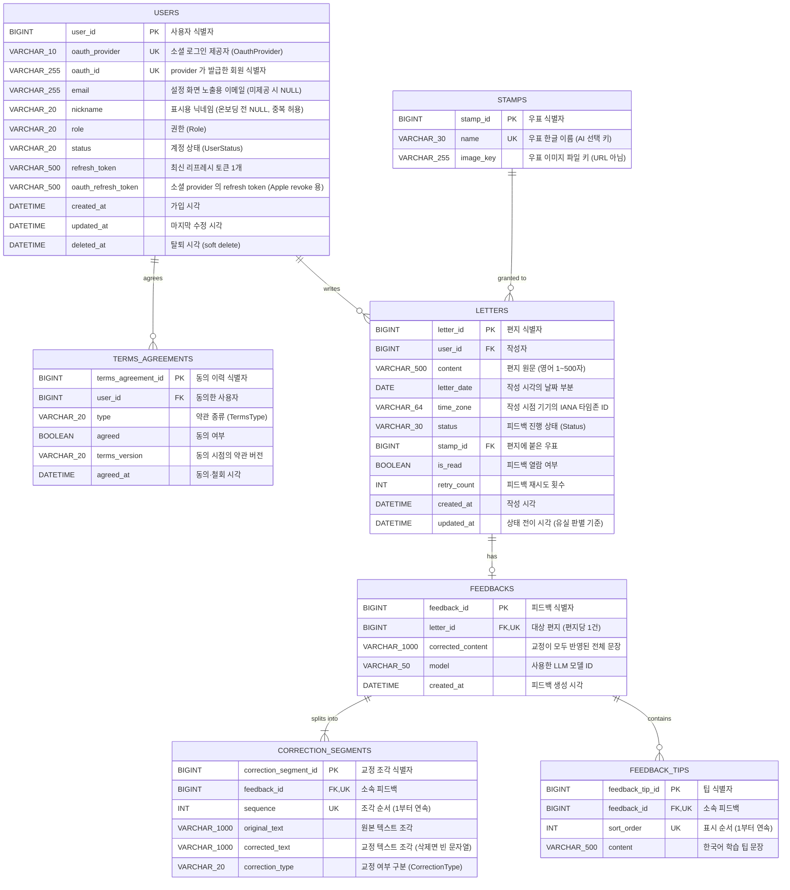

# Dear Jolly — ERD (데이터 모델)

> 이 문서는 Dear Jolly 서버 데이터 모델의 **정본**이다. 스키마에 관한 모든 판단은 이 문서를 따른다.
> 도메인 규칙 배경은 [기능명세.md](./기능명세.md), 요청/응답 계약은 [API명세.md](./API명세.md) 참고.

| 항목 | 내용 |
| --- | --- |
| 최종 갱신 | 2026-08-22 |
| DBMS | MySQL 8.x / `utf8mb4` · `utf8mb4_0900_ai_ci` |
| 스키마 관리 | **Flyway** 로 형상 관리. 스키마의 소유자는 마이그레이션이며 JPA 가 아니다 |
| ID 전략 | 전 테이블 `GenerationType.IDENTITY` (`BIGINT AUTO_INCREMENT`) |
| Enum 저장 | 전부 `EnumType.STRING` (문자열 저장) |
| 시각 컬럼 | `DATETIME(6)`. `@PrePersist` / `@PreUpdate` 로 주입. 서버 TZ `Asia/Seoul` |
| 날짜 컬럼 | `DATE`. **클라이언트가 보낸 작성 시각의 날짜 부분**을 그대로 저장하고, 해석에 쓴 타임존을 `LETTERS.time_zone` 에 함께 남긴다 (불변식 A3) |

---

## 목차

1. [ER 다이어그램](#1-er-다이어그램)
2. [테이블 정의](#2-테이블-정의)
3. [연관관계](#3-연관관계)
4. [Enum 정의](#4-enum-정의)
5. [제약 조건](#5-제약-조건)
6. [데이터 수명주기](#6-데이터-수명주기)
7. [부록: DDL](#7-부록-ddl)

---

## 1. ER 다이어그램



> 각 컬럼의 맨 우측 열은 **한글 설명**이다. 제약(NOT NULL · DEFAULT · UNIQUE 등)과 컬럼별 상세는 [2. 테이블 정의](#2-테이블-정의) 의 `제약` 열을 참고한다.

### 카디널리티

| 관계 | 카디널리티 | 의미 |
| --- | --- | --- |
| `USERS` → `TERMS_AGREEMENTS` | 1 : 0..N | 약관 동의는 이력으로 누적된다. 가입 직후에는 0행이고, 온보딩을 마치면 최소 3행이 쌓인다 |
| `USERS` → `LETTERS` | 1 : 0..N | 한 유저가 편지를 여러 통 작성한다 |
| `LETTERS` → `FEEDBACKS` | 1 : 0..1 | 편지 한 통당 피드백은 최대 1건이다 |
| `FEEDBACKS` → `CORRECTION_SEGMENTS` | 1 : 1..N | 피드백은 원문을 나눈 교정 조각을 순서대로 가진다 |
| `FEEDBACKS` → `FEEDBACK_TIPS` | 1 : 0..3 | 피드백은 학습 팁을 최대 3개까지 가진다 |

---

## 2. 테이블 정의

### 2.1 `USERS` — 사용자

| 컬럼 | 타입 | 제약 | 설명 |
| --- | --- | --- | --- |
| `user_id` | BIGINT | PK, AUTO_INCREMENT | |
| `oauth_provider` | VARCHAR(10) | NOT NULL | `KAKAO` / `APPLE` |
| `oauth_id` | VARCHAR(255) | NOT NULL | provider 가 발급한 회원 식별자 (Kakao `id`, Apple `sub`) |
| `email` | VARCHAR(255) | NULL | 설정 화면 노출용. Apple private relay 거부 등으로 provider 가 주지 않으면 NULL 이다. 서버가 대체 주소를 지어내지 않는다 |
| `nickname` | VARCHAR(20) | NULL | 1~20자, 영문·숫자만. **가입 시점에는 NULL** 이고 온보딩에서 채운다. 중복을 허용한다 |
| `role` | VARCHAR(20) | NOT NULL | `ROLE_USER` / `ROLE_ADMIN` |
| `status` | VARCHAR(20) | NOT NULL | `ACTIVE` / `WITHDRAWN` |
| `refresh_token` | VARCHAR(500) | NULL | 최신 refresh token 1개만 보관한다 (단일 세션 정책). 로그아웃·탈퇴 시 NULL |
| `oauth_refresh_token` | VARCHAR(500) | NULL | 소셜 provider 가 발급한 refresh token. **Apple 연결 해제(revoke) 에 필요**하다. 로그인 시 code 교환 결과로 받아 저장하고, 탈퇴 시 revoke 에 쓴 뒤 NULL 로 만든다 |
| `created_at` | DATETIME(6) | NOT NULL | 가입 시각 |
| `updated_at` | DATETIME(6) | NOT NULL | 마지막 수정 시각 |
| `deleted_at` | DATETIME(6) | NULL | 탈퇴 시각. `status = WITHDRAWN` 일 때만 값이 있다 |

- UNIQUE `(oauth_provider, oauth_id)` — 소셜 계정당 1계정.
- 로그인 시 회원 조회 키는 `(oauth_provider, oauth_id)` 다. `email` 은 표시용이며 provider 가 다르면 같은 주소가 존재할 수 있다.
- 닉네임은 중복을 허용한다. 표시용 이름이며 식별자로 쓰지 않는다.
- **온보딩 완료 여부는 별도 컬럼 없이 파생한다.** 약관 동의 여부는 `TERMS_AGREEMENTS` 조회로, 닉네임 등록 여부는 `nickname IS NOT NULL` 로 판별한다.
- `email` · `nickname` 이 NULL 일 수 있으므로 응답 DTO 에서도 nullable 이다.

### 2.2 `TERMS_AGREEMENTS` — 약관 동의 이력

약관 동의를 **행으로 누적**한다. 개인정보보호법상 "언제, 어느 버전에, 무엇에 동의했는가"를 사후에 입증할 수 있어야 하므로 값을 덮어쓰지 않는다.

| 컬럼 | 타입 | 제약 | 설명 |
| --- | --- | --- | --- |
| `terms_agreement_id` | BIGINT | PK, AUTO_INCREMENT | |
| `user_id` | BIGINT | FK → `USERS.user_id`, NOT NULL | 동의한 사용자 |
| `type` | VARCHAR(20) | NOT NULL | `SERVICE` / `PRIVACY` / `MARKETING` |
| `agreed` | BOOLEAN | NOT NULL | 동의 `true` / 미동의·철회 `false` |
| `terms_version` | VARCHAR(20) | NOT NULL | 동의 시점의 약관 버전. 서버 설정값 `dearjolly.terms.current-version` 을 그대로 기록한다 |
| `agreed_at` | DATETIME(6) | NOT NULL | 동의·철회 시각. **서버 시각(KST)** 으로 기록한다 |

- INDEX `(user_id, type, agreed_at DESC)` — 항목별 최신 행 조회.
- **현재 동의 상태 = `(user_id, type)` 별 `agreed_at` 이 가장 최신인 행의 `agreed`** 다. UNIQUE 제약을 두지 않는 이유가 이것이다.
- `POST /api/v1/users/terms` 는 요청에 담긴 항목마다 **행을 새로 INSERT** 한다. UPDATE 하지 않는다.
- `terms_version` 은 **기록·입증 목적**이다. 약관이 개정돼도 기존 유저에게 재동의를 요구하지 않으며, `termsAgreed` 판별에 버전을 쓰지 않는다. 재동의 유도는 MVP 범위 밖이다.
- 마케팅 동의를 철회하면 `agreed = false` 인 행이 하나 더 쌓인다. 이전 동의 이력은 그대로 남는다.
- 필수 약관(`SERVICE` · `PRIVACY`)에 동의하기 전까지 유저는 온보딩 미완료 상태이며, 본 기능 API 접근이 차단된다 (`USER_005`).

### 2.3 `LETTERS` — 편지

| 컬럼 | 타입 | 제약 | 설명 |
| --- | --- | --- | --- |
| `letter_id` | BIGINT | PK, AUTO_INCREMENT | API 의 `letterId` |
| `user_id` | BIGINT | FK → `USERS.user_id`, NOT NULL | 작성자 |
| `content` | VARCHAR(500) | NOT NULL | 편지 원문. 영어 전용, 1~500자 (R2). API 의 `originalContent` |
| `letter_date` | DATE | NOT NULL | 요청 `writtenAt` 의 날짜 부분 (R9). API 의 `date`. 목록 정렬·표시 기준 |
| `time_zone` | VARCHAR(64) | NOT NULL | 작성 시점 기기의 IANA 타임존 ID (예: `Asia/Seoul`). 요청의 `timeZone` 을 그대로 남긴다 |
| `status` | VARCHAR(30) | NOT NULL | `SUBMITTED` / `FEEDBACK_IN_PROGRESS` / `FEEDBACK_COMPLETED` / `FEEDBACK_FAILED` |
| `stamp_id` | BIGINT | FK → `STAMPS.stamp_id`, NULL | 편지에 붙은 우표. 등록 시 `soon` 이 들어가고, `FEEDBACK_COMPLETED` 전이 시 LLM 이 고른 우표가 된다 |
| `is_read` | BOOLEAN | NOT NULL, DEFAULT `false` | 피드백 열람 여부 (R6). `FEEDBACK_COMPLETED` 편지를 상세 조회할 때만 `true` 로 전환 |
| `retry_count` | INT | NOT NULL, DEFAULT `0` | 피드백 재시도 횟수. 3회를 소진하면 `FEEDBACK_FAILED` |
| `created_at` | DATETIME(6) | NOT NULL | 서버 저장 시각(KST). 응답의 `createdAt` 은 이 값을 요청 타임존으로 변환해 내려준다 |
| `updated_at` | DATETIME(6) | NOT NULL | 상태 전이 시각. 이벤트 유실·처리 유실 판별의 기준이다 |

- INDEX `(user_id, letter_date DESC, letter_id DESC)` — 목록 정렬·페이징.
- 중복 전달 판정(A17)의 "직전 편지 1건" 조회도 이 인덱스를 탄다. 편지는 append-only 이고 PK 가 AUTO_INCREMENT 라 `letter_id DESC` 가 곧 작성 역순이므로, `created_at` 정렬용 인덱스를 따로 두지 않는다.
- INDEX `(status, updated_at)` — 미처리 편지 스캔 배치. `SUBMITTED` 이벤트 유실(1시간 초과)과 `FEEDBACK_IN_PROGRESS` 처리 유실(15분 초과)을 이 인덱스로 찾는다.
- 워커 픽업은 `UPDATE letters SET status = 'FEEDBACK_IN_PROGRESS' WHERE letter_id = ? AND status = 'SUBMITTED'` 조건부 UPDATE 로 수행한다. 갱신 건수 0이면 다른 워커가 이미 집은 것이므로 처리를 건너뛴다.
- 편지는 append-only 다 (R1). 등록 후 `content` · `letter_date` · `time_zone` 은 변경되지 않으며, 사용자 요청으로 삭제되지도 않는다. 변경되는 컬럼은 `status` · `stamp_id` · `is_read` · `retry_count` · `updated_at` 뿐이다.
- **`time_zone` 을 저장하는 이유**는 `created_at` 때문이다. 저장은 서버 시각(KST)으로 하고 응답은 작성지 기준으로 내려주는데, 타임존을 남기지 않으면 그 변환이 **편지 작성 요청에서 단 한 번만** 가능하다. 이후의 모든 조회는 요청 바디가 없어 변환 근거를 잃고 KST 로 굳는다. 작성지 정보 자체도 편지의 맥락이라 함께 남긴다.
- 우표 카운트(R4)는 `status = 'FEEDBACK_COMPLETED'` 인 행 수로 계산한다.
- **재시도 백오프 상태는 DB 에 두지 않는다.** 워커가 인메모리 `TaskScheduler` 로 재호출을 예약하며, 예약이 유실된 경우에만 보완 스케줄러가 `updated_at` 기준으로 주워 담는다.

### 2.4 `STAMPS` — 우표 마스터

편지에 붙는 우표의 마스터 데이터다. 우표 종류는 코드가 아니라 이 테이블의 행으로 관리하므로, 추가·교체에 배포가 필요 없다.

| 컬럼 | 타입 | 제약 | 설명 |
| --- | --- | --- | --- |
| `stamp_id` | BIGINT | PK, AUTO_INCREMENT | |
| `name` | VARCHAR(30) | NOT NULL, UNIQUE | 우표 한글 이름 (예: `장미`). LLM 이 고른 이름을 이 컬럼으로 조회해 행을 특정한다 |
| `image_key` | VARCHAR(255) | NOT NULL | 오브젝트 스토리지의 **파일 키** (예: `stamp/꽃_장미.png`). URL 은 저장하지 않는다 |

**우표는 이름과 이미지가 전부다.** 컬럼을 이 둘로 좁힌 이유는 각각 분명하다.

- **설명 컬럼을 두지 않는다.** 이름 자체가 이미 분위기를 담고 있어(`장미` · `초승달` · `네잎클로버`) LLM 이 편지에 어울리는 것을 고르는 데 부연이 필요 없고, 앱은 이미지만 렌더링하므로 설명이 노출될 지점도 없다. 아무도 읽지 않는 문구를 우표를 추가할 때마다 지어내야 하는 비용만 남는다.
- **활성 여부 컬럼을 두지 않는다.** 후보에서 빠지는 행은 기본 우표 `soon` 하나뿐이고, 이름으로 걸러진다. "있지만 안 쓰는 우표" 라는 상태는 실체가 없어 플래그 컬럼을 둘 이유가 없다.
- `name` 이 UNIQUE 인 이유는 LLM 응답을 행으로 되돌리는 조회 키이기 때문이다.
- **행을 지울 때는 `LETTERS.stamp_id` 가 참조하지 않는지 확인해야 한다.** FK 가 걸려 있어 참조 중이면 DB 가 거부한다. 우표를 바꾸고 싶을 때의 정상 경로는 삭제가 아니라 `image_key` 교체다 — 이미 그 우표를 받은 편지의 이미지까지 함께 바뀐다.
- 이미지 교체는 `image_key` 갱신으로 처리한다. 앱 배포와 무관하다.
- **DB 에는 파일 키만 저장하고 URL 은 저장하지 않는다.** 응답의 `stampImage` 는 서버가 조회 시점에 조립한다.

```
stampImage = ${MINIO_PUBLIC_ENDPOINT} + "/" + ${MINIO_BUCKET} + "/" + image_key
```

  스토리지 주소는 환경마다 다르고 도메인 교체·CDN 도입 시 바뀐다.
  URL 을 저장해 두면 그때마다 전체 행을 일괄 수정해야 하지만, 파일 키만 저장하면 환경변수만 갈아끼우면 된다.
  조립은 `global/storage/FileUrlProvider` 가 담당하며, `image_key` 가 비어 있으면 `null` 을 반환한다.
- **우표 종류는 Java enum 으로 정의하지 않는다.** 코드에 우표 이름이 하드코딩되면 이 테이블의 존재 이유가 사라진다.
- 우표를 추가할 때 채울 값은 **이름과 파일 키 두 개뿐**이다.

#### 초기 데이터 시드

행을 손으로 넣지 않는다. 이미지 원본이 `src/main/resources/seed/stamps/*.png` 로 애플리케이션에 함께 실리고,
기동할 때 `global/seed/StampSeeder` 가 MinIO 업로드와 행 삽입을 함께 처리한다.

| 항목 | 규칙 |
| --- | --- |
| `name` | 확장자를 뗀 파일명 그대로 (`꽃_장미.png` → `꽃_장미`) |
| `image_key` | `stamp/` + 파일명 (`stamp/꽃_장미.png`) |
| 순서 | 기본 우표 `soon` 이 항상 첫 행(`stamp_id = 1`), 나머지는 파일명 순 |
| 재실행 | 같은 키에 같은 크기로 올라가 있으면 업로드를 건너뛰고, 같은 `name` 행이 있으면 `image_key` 가 다를 때만 갱신한다 |

`soon` 은 편지 등록 시점에 붙는 "준비 중" 우표다. `stamp_id = 1` 에 고정되고 LLM 우표 선택 후보에서는 빠진다 (A9-1).

#### API 테스트용 목 사용자 시드 (로컬 전용)

`global/seed/MockUserSeeder` 가 약관 동의·닉네임까지 끝난 계정 하나와 편지 몇 통을 넣는다.
`USERS` · `TERMS_AGREEMENTS` · `LETTERS` · `FEEDBACKS` · `CORRECTION_SEGMENTS` · `FEEDBACK_TIPS` 를 가로질러 만들며,
`(oauth_provider, oauth_id)` 와 `LETTERS.content` 를 자연키로 삼아 재기동해도 행이 불어나지 않는다.
기본값은 꺼짐이고 `.env.local` 에서만 켠다. 실행 방법은 [infra/RUN.md](../infra/RUN.md) 를 본다.
편지가 실제로 받는 우표는 피드백이 완료되는 시점에 정해진다.

파일명이 곧 `name` 이자 파일 키라서 **파일을 넣는 것 외에 채울 값이 없다.** 우표를 추가하려면 이미지를 이 폴더에 두고 배포하면 된다.
반대로 파일명을 바꾸면 새 이름의 행이 하나 더 생기므로, 이름 변경은 `image_key` 교체가 아니라 새 우표 추가로 취급된다.

#### 우표 부여 절차

1. 피드백 워커가 `SELECT name FROM stamps WHERE name <> 'soon'` 으로 후보를 조회한다. `soon` 을 제외한 모든 행이 후보다.
2. 조회한 **한글 이름 목록을 프롬프트에 동적으로 삽입**하고, 편지 내용에 가장 어울리는 우표 이름 하나를 고르게 한다. 우표 종류가 늘거나 줄어도 프롬프트 템플릿은 그대로다.
3. LLM 이 반환한 이름을 `name` 으로 조회해 `LETTERS.stamp_id` 에 채운다.
4. 반환값이 후보 목록에 없으면 랜덤 1개로 대체한다. 우표 선택 실패가 피드백 저장 전체를 실패시키지 않는다.

우표 부여는 `status = 'FEEDBACK_COMPLETED'` 전이와 동일한 트랜잭션에서 이뤄진다 (R3).

### 2.5 `FEEDBACKS` — AI 피드백

| 컬럼 | 타입 | 제약 | 설명 |
| --- | --- | --- | --- |
| `feedback_id` | BIGINT | PK, AUTO_INCREMENT | API 의 `feedbackId` |
| `letter_id` | BIGINT | FK → `LETTERS.letter_id`, NOT NULL, UNIQUE | 편지 1 : 피드백 0..1 |
| `corrected_content` | VARCHAR(1000) | NOT NULL | 교정이 모두 반영된 전체 문장 |
| `model` | VARCHAR(50) | NOT NULL | 사용한 LLM 모델 ID. 재현·과금 추적용 |
| `created_at` | DATETIME(6) | NOT NULL | |

- 피드백 저장, 교정 조각·팁 저장, `LETTERS.status` 전이와 우표 부여는 **하나의 트랜잭션**에서 처리한다. 부분 저장 상태는 존재하지 않는다.
- `corrected_content` 가 원문(500자)보다 긴 1000자인 이유는 교정으로 문장이 길어질 수 있기 때문이다.

### 2.6 `CORRECTION_SEGMENTS` — 교정 조각

원문을 `sequence` 순으로 잘게 나눈 조각이다. 순서대로 이어붙이면 원문과 교정문이 그대로 복원되므로, 앱은 인덱스 계산 없이 순차 렌더링만 한다.

| 컬럼 | 타입 | 제약 | 설명 |
| --- | --- | --- | --- |
| `correction_segment_id` | BIGINT | PK, AUTO_INCREMENT | |
| `feedback_id` | BIGINT | FK → `FEEDBACKS.feedback_id`, NOT NULL | |
| `sequence` | INT | NOT NULL | 조각 순서. 1부터 연속 증가 |
| `original_text` | VARCHAR(1000) | NOT NULL | 원본 텍스트 조각 |
| `corrected_text` | VARCHAR(1000) | NOT NULL | 교정된 텍스트 조각. 삭제 제안이면 빈 문자열 |
| `correction_type` | VARCHAR(20) | NOT NULL | `UNCHANGED` / `MODIFIED`. **API 응답에서는 `type` 이라는 이름으로 내려간다** |

- UNIQUE `(feedback_id, sequence)`.
- 조회 시 항상 `ORDER BY sequence ASC` 로 정렬한다 (`@OrderBy("sequence ASC")`).
- 공백은 조각 문자열에 포함해 저장한다. 앱은 조각 사이에 공백을 넣지 않는다.
- `correction_type` 은 저장 시 `original_text` 와 `corrected_text` 의 일치 여부로 결정된다 (불변식 A5).
- **두 텍스트 컬럼의 상한은 `FEEDBACKS.corrected_content` 와 같은 1000자다.** A7 이 "조각을 이어붙이면 교정문 전체" 를 요구하므로, 교정문이 길고 diff 가 단일 `MODIFIED` 로 뭉치면 조각 하나가 문장 전체가 된다. 원문 상한은 500 이라 `original_text` 는 절반만 쓰지만, 두 컬럼을 같은 길이로 맞춰야 조각 분할·병합 로직에 길이 제약이 생기지 않는다.

### 2.7 `FEEDBACK_TIPS` — 학습 팁

검토 화면 하단에 노출하는 한국어 학습 팁이다.

| 컬럼 | 타입 | 제약 | 설명 |
| --- | --- | --- | --- |
| `feedback_tip_id` | BIGINT | PK, AUTO_INCREMENT | |
| `feedback_id` | BIGINT | FK → `FEEDBACKS.feedback_id`, NOT NULL | |
| `content` | VARCHAR(500) | NOT NULL | 한국어 설명 문장 |
| `sort_order` | INT | NOT NULL | 표시 순서. 1부터 연속 증가 |

- UNIQUE `(feedback_id, sort_order)` — `CORRECTION_SEGMENTS` 와 동일한 순서 보장 규칙을 적용한다.
- 한 피드백당 0~3행이다. 디자인의 팁없음 / 팁단일 / 팁여러개 세 가지 상태에 대응한다.
- 조회 시 `ORDER BY sort_order ASC` 로 정렬하고, API 응답에서는 `feedback.tips` 문자열 배열로 평탄화한다.

---

## 3. 연관관계

### 3.1 매핑 정의

| 관계 | 소유 측 (FK 보유) | 반대 측 | Fetch | Cascade | orphanRemoval |
| --- | --- | --- | --- | --- | --- |
| `Users` ↔ `TermsAgreements` | `TermsAgreements.user` `@ManyToOne` | `Users.termsAgreements` `@OneToMany(mappedBy="user")` | LAZY | ALL | true |
| `Users` ↔ `Letters` | `Letters.user` `@ManyToOne` | `Users.letters` `@OneToMany(mappedBy="user")` | LAZY | ALL | true |
| `Stamps` → `Letters` | `Letters.stamp` `@ManyToOne` | 단방향 (역방향 매핑 없음) | LAZY | 없음 | false |
| `Letters` ↔ `Feedbacks` | `Feedbacks.letter` `@OneToOne` | `Letters.feedback` `@OneToOne(mappedBy="letter")` | LAZY | ALL | true |
| `Feedbacks` ↔ `CorrectionSegments` | `CorrectionSegments.feedback` `@ManyToOne` | `Feedbacks.correctionSegments` `@OneToMany(mappedBy="feedback")` | LAZY | ALL | true |
| `Feedbacks` ↔ `FeedbackTips` | `FeedbackTips.feedback` `@ManyToOne` | `Feedbacks.tips` `@OneToMany(mappedBy="feedback")` | LAZY | ALL | true |

`Stamps` 는 마스터 데이터라 편지 쪽에서만 참조하는 단방향이다. cascade 를 걸지 않으므로 편지·유저 삭제가 우표 행에 영향을 주지 않는다.

> **Fetch 열의 예외 하나** — `Letters.feedback` 은 `@OneToOne(mappedBy)` 라 `LAZY` 로 선언해도 실제로는 즉시 로딩된다. FK 를 갖지 않는 쪽이라 Hibernate 가 "행이 있는지" 를 알아야 프록시 여부를 정할 수 있기 때문이다. 선언은 의도 표시로 남겨 두되, 성능을 논할 때는 조회 전략을 기준으로 판단한다.

### 3.2 연관관계 편의 메서드

양방향 관계의 동기화는 정적 팩토리 메서드 안에서 이뤄진다. 생성자는 `private` 이므로 한쪽만 세팅된 상태는 만들어지지 않는다.

| 생성 메서드 | 내부 동기화 |
| --- | --- |
| `TermsAgreements.create(user, …)` | `user.addTermsAgreement(agreement)` |
| `Letters.create(user, …)` | `user.addLetter(letter)` |
| `Feedbacks.create(letter, …)` | `letter.registerFeedback(feedback)` |
| `CorrectionSegments.create(feedback, …)` | `feedback.addCorrectionSegment(segment)` |
| `FeedbackTips.create(feedback, …)` | `feedback.addTip(tip)` |

### 3.3 삭제 전파

`Users` → (`TermsAgreements`, `Letters`) → `Feedbacks` → (`CorrectionSegments`, `FeedbackTips`) 순으로 JPA cascade 가 전 구간 연쇄 삭제한다. 회원탈퇴 유예기간이 끝났을 때의 전량 삭제(R8) 요건은 이 경로 하나로 충족한다.

- **삭제 순서를 코드가 직접 지정하지 않는다.** 유예기간 만료 배치는 `Users` 엔티티를 조회해 `delete(user)` 만 호출하고, 나머지는 cascade 에 맡긴다.
- cascade 는 영속성 컨텍스트를 거칠 때만 동작하므로, 삭제는 항상 엔티티를 조회한 뒤 `delete(entity)` 로 수행한다. 벌크 DELETE 쿼리는 사용하지 않는다.
- DB 레벨 `ON DELETE CASCADE` 는 걸지 않는다. 삭제 경로를 애플리케이션 한 곳으로 통일하기 위해서다.

### 3.4 조회 전략

- `@OneToOne(mappedBy)` 인 `Letters.feedback` 은 FK 미보유 측이라 Hibernate 가 프록시를 만들 수 없고 항상 즉시 로딩된다. 따라서 **편지 목록 조회는 엔티티 그래프를 타지 않고 DTO projection 으로 처리**한다.
- 편지·피드백 상세 조회는 `LETTERS` → `FEEDBACKS` → `CORRECTION_SEGMENTS` / `FEEDBACK_TIPS` 를 `fetch join` 으로 한 번에 가져온다. 컬렉션이 둘이므로 `CORRECTION_SEGMENTS` 만 join 하고 `FEEDBACK_TIPS` 는 `@BatchSize` 로 로딩해 MultipleBagFetchException 을 피한다.
- 홈의 우표 카운트는 엔티티 로딩 없이 `count` 쿼리로 계산한다.
- 목록 응답의 `stampImage` 는 `LETTERS` 와 `STAMPS` 를 join 해 DTO 로 한 번에 가져온다. 행 수가 적고 변경이 드문 마스터 데이터이므로 2차 캐시 적용 대상이다.
- 약관 동의 상태는 `(user_id, type)` 별 최신 1행을 뽑는 조회다. 항목이 3개뿐이므로 `user_id` 로 전체를 가져와 애플리케이션에서 `type` 별 최신을 고르거나, 윈도우 함수로 한 번에 조회한다.

---

## 4. Enum 정의

모두 `EnumType.STRING` 으로 저장한다. `ORDINAL` 은 사용하지 않는다.

우표 종류는 enum 이 아니라 `STAMPS` 테이블의 행으로 관리한다.

### 4.1 `OauthProvider` — `USERS.oauth_provider`

| 값 | 설명 |
| --- | --- |
| `KAKAO` | 카카오 로그인 |
| `APPLE` | 애플 로그인 |

API 요청/응답의 `provider` 필드가 이 enum 이다. 문서 전체에서 이름을 `OauthProvider` 로 통일한다.

### 4.2 `Role` — `USERS.role`

| 값 | 설명 |
| --- | --- |
| `ROLE_USER` | 일반 사용자. `Users.create(…)` 의 기본값 |
| `ROLE_ADMIN` | 관리자. `Users.createAdmin(…)` 로만 생성 |

MVP 에는 관리자 전용 API 가 없다. `ROLE_ADMIN` 은 운영자 수동 재처리 같은 후속 경로를 위해 스키마에만 존재한다.

### 4.3 `UserStatus` — `USERS.status`

| 값 | 설명 |
| --- | --- |
| `ACTIVE` | 정상 이용 중 |
| `WITHDRAWN` | 탈퇴 처리됨. 모든 API 접근 차단(`AUTH_007`). 유예기간 경과 후 행 삭제 |

### 4.4 `TermsType` — `TERMS_AGREEMENTS.type`

| 값 | 필수 여부 | 설명 |
| --- | --- | --- |
| `SERVICE` | 필수 | 서비스 이용약관 |
| `PRIVACY` | 필수 | 개인정보 처리방침 |
| `MARKETING` | 선택 | 마케팅 수신 동의. 설정에서 철회할 수 있다 |

`SERVICE` 와 `PRIVACY` 의 최신 행이 모두 `agreed = true` 여야 온보딩 약관 단계를 통과한 것으로 본다.

### 4.5 `Status` — `LETTERS.status`

| 값 | 의미 | 앱 표현 |
| --- | --- | --- |
| `SUBMITTED` | 제출됨, 워커 픽업 대기 | 서버가 내려준 `soon` 우표, 상세 진입 불가 (R5) |
| `FEEDBACK_IN_PROGRESS` | 워커가 픽업해 LLM 호출 중 | 서버가 내려준 `soon` 우표, 상세 진입 불가 (`SUBMITTED` 와 동일) |
| `FEEDBACK_COMPLETED` | 피드백 완료 | 컬러 우표, 상세 진입 가능 |
| `FEEDBACK_FAILED` | 피드백 실패 (내부 전용) | API 응답에서는 `SUBMITTED` 로 변환해 내려보낸다 |

전이 규칙은 기능명세를 따른다. 임시저장 상태는 두지 않으며, 편지는 항상 `SUBMITTED` 로 생성된다.

- 컬럼 길이가 VARCHAR(30) 인 이유는 가장 긴 값 `FEEDBACK_IN_PROGRESS` 가 20자이기 때문이다. 여유를 포함해 30으로 잡는다.
- `FEEDBACK_IN_PROGRESS` 는 워커 중복 실행 방지와 처리 유실 판별을 위한 상태다. 두 워커가 같은 편지를 집지 못하도록 진입을 조건부 UPDATE 로 막고, 이 상태로 15분 이상 머문 편지는 호출 도중 종료된 것으로 보고 `SUBMITTED` 로 되돌려 재큐잉한다.
- `FEEDBACK_IN_PROGRESS` 는 API 응답에 그대로 내려간다. 앱은 `FEEDBACK_COMPLETED` 인지 아닌지만 구분하므로 `SUBMITTED` 와 동일하게 렌더링한다. 내부 전용인 `FEEDBACK_FAILED` 만 `SUBMITTED` 로 치환한다.

### 4.6 `CorrectionType` — `CORRECTION_SEGMENTS.correction_type`

| 값 | 설명 | 앱 렌더링 |
| --- | --- | --- |
| `UNCHANGED` | 교정 없음 | 검은 글씨 그대로 |
| `MODIFIED` | 교정됨 | 원문에 빨간 취소선 + 뒤에 교정문 초록 하이라이트 |

문법·어휘·철자 등 세부 교정 카테고리는 두지 않는다. API 응답에서의 필드명은 `type` 이다.

---

## 5. 제약 조건

### 5.1 DB 제약

| 종류 | 대상 |
| --- | --- |
| PRIMARY KEY | `USERS.user_id`, `TERMS_AGREEMENTS.terms_agreement_id`, `LETTERS.letter_id`, `STAMPS.stamp_id`, `FEEDBACKS.feedback_id`, `CORRECTION_SEGMENTS.correction_segment_id`, `FEEDBACK_TIPS.feedback_tip_id` |
| FOREIGN KEY | `TERMS_AGREEMENTS.user_id` → `USERS`, `LETTERS.user_id` → `USERS`, `LETTERS.stamp_id` → `STAMPS`, `FEEDBACKS.letter_id` → `LETTERS`, `CORRECTION_SEGMENTS.feedback_id` → `FEEDBACKS`, `FEEDBACK_TIPS.feedback_id` → `FEEDBACKS` |
| UNIQUE | `USERS (oauth_provider, oauth_id)`, `STAMPS.name`, `FEEDBACKS.letter_id`, `CORRECTION_SEGMENTS (feedback_id, sequence)`, `FEEDBACK_TIPS (feedback_id, sort_order)` |
| INDEX | `LETTERS (user_id, letter_date DESC, letter_id DESC)`, `LETTERS (status, updated_at)`, `TERMS_AGREEMENTS (user_id, type, agreed_at DESC)` |
| DEFAULT | `LETTERS.is_read = false`, `LETTERS.retry_count = 0` |
| NULL 허용 | `USERS.email`, `USERS.nickname`, `USERS.refresh_token`, `USERS.oauth_refresh_token`, `USERS.deleted_at`, `LETTERS.stamp_id` — 나머지 전 컬럼 NOT NULL |

`TERMS_AGREEMENTS` 에는 UNIQUE 를 두지 않는다. 이력 테이블이므로 같은 `(user_id, type)` 조합이 여러 번 나타나는 것이 정상이다.

### 5.2 애플리케이션이 보장하는 불변식

| # | 규칙 | 근거 | 강제 위치 |
| --- | --- | --- | --- |
| A1 | `content` 는 한글을 포함하지 않고 1~500자 | R2 | Bean Validation + 서비스 |
| A2 | 편지는 등록 후 `content` · `letter_date` · `time_zone` 불변, 사용자 삭제 불가 | R1 | 편지 엔티티에 해당 수정 메서드를 두지 않음 |
| A3 | `letter_date` 는 요청 `writtenAt` 의 날짜 부분이다. `writtenAt` 을 `timeZone` 으로 해석한 절대 시각이 서버 현재 시각 ±24시간을 벗어나면 거부한다 | R9 | 편지 작성 서비스 |
| A3-1 | `time_zone` 은 `ZoneId` 로 파싱에 성공한 값만 저장한다. 엔티티가 문자열이 아니라 `ZoneId` 를 받으므로 해석 불가능한 값은 저장될 수 없다 | R9 | `Letters` 생성자 |
| A4 | `nickname` 은 영문·숫자 1~20자 (NULL 이 아닌 경우) | R7 | `UserValidationConstants` |
| A5 | `correction_type` 은 `original_text.equals(corrected_text)` 이면 `UNCHANGED`, 아니면 `MODIFIED` | — | `CorrectionSegments` 생성자 |
| A6 | `concat(original_text ORDER BY sequence)` == `LETTERS.content` | 교정 세그먼트 생성 규칙 | 피드백 저장 트랜잭션 |
| A7 | `concat(corrected_text ORDER BY sequence)` == `FEEDBACKS.corrected_content` | 교정 세그먼트 생성 규칙 | 피드백 저장 트랜잭션 |
| A8 | `FEEDBACK_TIPS` 는 피드백당 최대 3행. LLM 이 더 많이 반환하면 **앞 3개만 저장**하고 나머지는 버린다 | LLM 응답 계약 | 워커가 저장 전 절삭 (`Feedbacks.MAX_TIP_COUNT`). 엔티티의 개수 검사는 절삭을 빠뜨렸을 때의 방어선이다 |
| A9 | `stamp_id` 는 등록 시 `soon`, `FEEDBACK_COMPLETED` 전이 시 LLM 이 고른 우표다 | R3 | 상태 전이 메서드 |
| A9-1 | LLM 이 반환한 우표 이름이 후보 목록에 없으면 랜덤 1개로 대체한다. 후보는 `soon` 을 제외한 `STAMPS` 전 행이다 | — | 우표 부여 로직 |
| A10 | `FEEDBACKS` 행이 존재하면 `LETTERS.status` 는 `FEEDBACK_COMPLETED` | — | 피드백 저장 트랜잭션 |
| A11 | `SUBMITTED → FEEDBACK_IN_PROGRESS` 전이는 조건부 UPDATE 로만 수행하고, 갱신 건수 0이면 처리를 중단한다 | 워커 중복 실행 방지 | 피드백 워커 |
| A12 | `retry_count >= 3` 이면 `status = 'FEEDBACK_FAILED'`. 백오프 3단계(30s → 2m → 10m)를 모두 소진한 상태다 | 편지 상태 전이 | 피드백 워커 |
| A13 | `status = 'WITHDRAWN'` 이면 `deleted_at` NOT NULL, `refresh_token` · `oauth_refresh_token` NULL | R8 | 탈퇴 서비스 |
| A14 | `refresh_token` 은 유저당 1개만 유지 (단일 세션) | — | 인증 서비스 |
| A15 | 온보딩 완료 = `SERVICE` · `PRIVACY` 의 최신 행이 모두 `agreed = true` **그리고** `nickname IS NOT NULL` | 온보딩 규칙 | 온보딩 가드 (`USER_005`) |
| A16 | `TERMS_AGREEMENTS` 는 UPDATE 하지 않고 INSERT 만 한다 | 약관 동의 이력 | 약관 동의 서비스 |
| A17 | 동일 유저가 60초 이내에 같은 `content` 를 다시 보내면 새 행을 만들지 않고 최초 편지를 반환한다 | 중복 전달 방지 | 편지 작성 서비스 |

---

## 6. 데이터 수명주기

### 6.1 편지

편지는 append-only 다. 작성되면 `SUBMITTED` 로 저장되고, 워커가 픽업하면 `FEEDBACK_IN_PROGRESS`, 저장에 성공하면 `FEEDBACK_COMPLETED` 로 전이한다. LLM 호출이 실패하면 `SUBMITTED` 로 되돌려 재시도하고, 3회를 넘기면 `FEEDBACK_FAILED` 로 확정한다. 사용자에게 노출되는 삭제 경로는 회원탈퇴뿐이다.

| 전이 | 트리거 | 함께 갱신되는 컬럼 |
| --- | --- | --- |
| → `SUBMITTED` | 편지 작성 | `stamp_id` 에 기본 우표(`soon`) 부여, `is_read = false`, `retry_count = 0` |
| `SUBMITTED` → `FEEDBACK_IN_PROGRESS` | 워커 픽업 (조건부 UPDATE) | `updated_at` |
| `FEEDBACK_IN_PROGRESS` → `FEEDBACK_COMPLETED` | LLM 응답 저장 성공 | `stamp_id` 에 LLM 이 고른 우표, `updated_at` |
| `FEEDBACK_IN_PROGRESS` → `SUBMITTED` | LLM 실패 재시도 (워커가 백오프 후 재예약) | `retry_count++`, `updated_at` |
| `FEEDBACK_IN_PROGRESS` → `SUBMITTED` | 처리 유실 감지 (15분 초과) | `updated_at` |
| `SUBMITTED` → `SUBMITTED` | 이벤트·재예약 유실 감지 (1시간 초과) 후 재큐잉 | `updated_at` |
| `FEEDBACK_IN_PROGRESS` → `FEEDBACK_FAILED` | 재시도 3회 초과 · 복구 불가 오류 | `updated_at` |
| `FEEDBACK_FAILED` → `SUBMITTED` | 운영자 수동 재처리 | `retry_count = 0`, `updated_at` |

### 6.2 회원탈퇴 — soft delete 후 지연 삭제

| 단계 | 시점 | 처리 |
| --- | --- | --- |
| 1. 탈퇴 요청 | 즉시 | `status = 'WITHDRAWN'`, `deleted_at = now()`, `refresh_token`·`oauth_refresh_token = NULL`. 이후 모든 API 접근이 `AUTH_007` 로 차단된다 |
| 2. 유예기간 | 30일 | 데이터는 보존한다. 사용자에게 노출되는 복구 수단은 없다 |
| 3. 완전 삭제 | `deleted_at + 30일` 경과 | 배치가 `USERS` 행을 삭제하고, cascade 로 약관 이력·편지·피드백·교정 조각·팁까지 전량 제거한다 |

- **탈퇴한 계정으로 다시 로그인하면 항상 신규 가입으로 처리한다.** 이전 편지는 복원되지 않는다.
- 유예기간 중인 계정은 `(oauth_provider, oauth_id)` UNIQUE 를 점유하므로, 재로그인 시점에 기존 행의 `oauth_id` 를 `{oauth_id}#withdrawn#{deleted_at 에폭밀리}` 형태로 치환해 UNIQUE 를 비우고 새 행을 만든다. 치환 후에도 삭제 배치는 `deleted_at` 으로 대상을 식별하므로 영향이 없다.
- 치환 결과가 255자를 넘으면 **앞쪽 원본 식별자를 잘라내 접미사를 보존**한다. 접미사에 담긴 에폭밀리가 UNIQUE 를 실제로 비우는 부분이기 때문이다. Kakao `id`(숫자)·Apple `sub`(약 44자) 모두 실제로는 잘릴 일이 없고, 이 처리는 provider 가 긴 식별자를 발급할 때를 대비한 것이다.
- 2단계는 오삭제 복구·분쟁 대응을 위한 **내부 보존**이다. 앱 문구에는 노출하지 않으며, 개인정보처리방침의 보유기간 항목에 명시한다.
- 3단계 삭제는 되돌릴 수 없다 (R8).

### 6.3 약관 동의 이력

`TERMS_AGREEMENTS` 는 UPDATE 하지 않고 INSERT 만 하는 이력 테이블이다 (불변식 A16).

- 온보딩에서 약관에 동의하면 `SERVICE` · `PRIVACY` · `MARKETING` 3행이 한 번에 쌓인다.
- 설정에서 마케팅 동의를 철회하면 `type = 'MARKETING'`, `agreed = false` 행이 하나 더 쌓인다. 이전 행은 그대로 남는다.
- 현재 동의 상태를 알고 싶으면 `(user_id, type)` 별 `agreed_at` 최신 행을 본다.
- 유저 행이 삭제되면 동의 이력도 cascade 로 함께 삭제된다. 탈퇴 이력은 개인정보를 제외한 최소 정보만 애플리케이션 로그로 별도 보관한다.

---

## 7. 부록: DDL

Flyway 마이그레이션 `V1__init.sql` 의 내용이다. 이 문서와 마이그레이션 스크립트가 어긋나면 **이 문서를 기준으로 스크립트를 고친다.**

```sql
CREATE TABLE users (
    user_id        BIGINT       NOT NULL AUTO_INCREMENT,
    oauth_provider VARCHAR(10)  NOT NULL,
    oauth_id       VARCHAR(255) NOT NULL,
    email          VARCHAR(255) NULL,
    nickname       VARCHAR(20)  NULL,
    role           VARCHAR(20)  NOT NULL,
    status         VARCHAR(20)  NOT NULL,
    refresh_token  VARCHAR(500) NULL,
    oauth_refresh_token VARCHAR(500) NULL,
    created_at     DATETIME(6)  NOT NULL,
    updated_at     DATETIME(6)  NOT NULL,
    deleted_at     DATETIME(6)  NULL,
    PRIMARY KEY (user_id),
    UNIQUE KEY uk_users_oauth (oauth_provider, oauth_id)
) ENGINE = InnoDB DEFAULT CHARSET = utf8mb4;

CREATE TABLE terms_agreements (
    terms_agreement_id BIGINT      NOT NULL AUTO_INCREMENT,
    user_id            BIGINT      NOT NULL,
    type               VARCHAR(20) NOT NULL,
    agreed             BOOLEAN     NOT NULL,
    terms_version      VARCHAR(20) NOT NULL,
    agreed_at          DATETIME(6) NOT NULL,
    PRIMARY KEY (terms_agreement_id),
    CONSTRAINT fk_terms_user FOREIGN KEY (user_id) REFERENCES users (user_id),
    KEY idx_terms_latest (user_id, type, agreed_at DESC)
) ENGINE = InnoDB DEFAULT CHARSET = utf8mb4;

CREATE TABLE stamps (
    stamp_id    BIGINT       NOT NULL AUTO_INCREMENT,
    name        VARCHAR(30)  NOT NULL,
    image_key   VARCHAR(255) NOT NULL,
    PRIMARY KEY (stamp_id),
    UNIQUE KEY uk_stamps_name (name)
) ENGINE = InnoDB DEFAULT CHARSET = utf8mb4;

CREATE TABLE letters (
    letter_id   BIGINT       NOT NULL AUTO_INCREMENT,
    user_id     BIGINT       NOT NULL,
    stamp_id    BIGINT       NULL,
    content     VARCHAR(500) NOT NULL,
    letter_date DATE         NOT NULL,
    time_zone   VARCHAR(64)  NOT NULL,
    status      VARCHAR(30)  NOT NULL,
    is_read     BOOLEAN      NOT NULL DEFAULT FALSE,
    retry_count INT          NOT NULL DEFAULT 0,
    created_at  DATETIME(6)  NOT NULL,
    updated_at  DATETIME(6)  NOT NULL,
    PRIMARY KEY (letter_id),
    CONSTRAINT fk_letters_user FOREIGN KEY (user_id) REFERENCES users (user_id),
    CONSTRAINT fk_letters_stamp FOREIGN KEY (stamp_id) REFERENCES stamps (stamp_id),
    KEY idx_letters_list (user_id, letter_date DESC, letter_id DESC),
    KEY idx_letters_pending (status, updated_at)
) ENGINE = InnoDB DEFAULT CHARSET = utf8mb4;

CREATE TABLE feedbacks (
    feedback_id       BIGINT        NOT NULL AUTO_INCREMENT,
    letter_id         BIGINT        NOT NULL,
    corrected_content VARCHAR(1000) NOT NULL,
    model             VARCHAR(50)   NOT NULL,
    created_at        DATETIME(6)   NOT NULL,
    PRIMARY KEY (feedback_id),
    UNIQUE KEY uk_feedbacks_letter (letter_id),
    CONSTRAINT fk_feedbacks_letter FOREIGN KEY (letter_id) REFERENCES letters (letter_id)
) ENGINE = InnoDB DEFAULT CHARSET = utf8mb4;

CREATE TABLE correction_segments (
    correction_segment_id BIGINT       NOT NULL AUTO_INCREMENT,
    feedback_id           BIGINT       NOT NULL,
    sequence              INT          NOT NULL,
    original_text         VARCHAR(1000) NOT NULL,
    corrected_text        VARCHAR(1000) NOT NULL,
    correction_type       VARCHAR(20)  NOT NULL,
    PRIMARY KEY (correction_segment_id),
    UNIQUE KEY uk_segments_order (feedback_id, sequence),
    CONSTRAINT fk_segments_feedback FOREIGN KEY (feedback_id) REFERENCES feedbacks (feedback_id)
) ENGINE = InnoDB DEFAULT CHARSET = utf8mb4;

CREATE TABLE feedback_tips (
    feedback_tip_id BIGINT       NOT NULL AUTO_INCREMENT,
    feedback_id     BIGINT       NOT NULL,
    content         VARCHAR(500) NOT NULL,
    sort_order      INT          NOT NULL,
    PRIMARY KEY (feedback_tip_id),
    UNIQUE KEY uk_tips_order (feedback_id, sort_order),
    CONSTRAINT fk_tips_feedback FOREIGN KEY (feedback_id) REFERENCES feedbacks (feedback_id)
) ENGINE = InnoDB DEFAULT CHARSET = utf8mb4;
```

우표는 마이그레이션이 아니라 운영 중 행을 넣어 등록한다. 넣는 즉시 프롬프트 후보 목록과 앱 응답에 반영된다.
